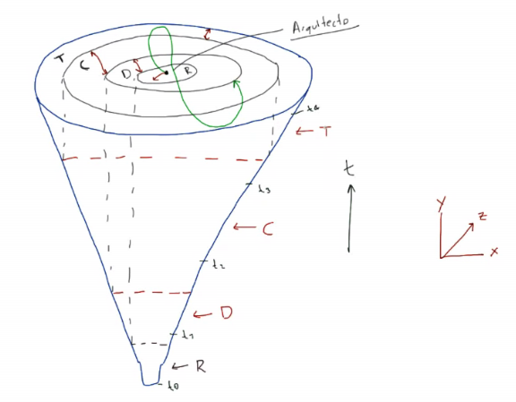
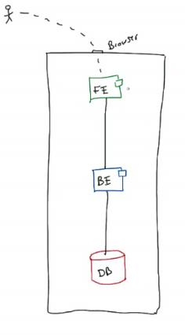

## Objetivo de la clase

- Adquirir los fundamentos de la arquitectura de software.
- Diferenciar entre diseño detallado y diseño arquitectónico.

## Apuntes

### Conceptos básicos

- **Arquitectura de software:**
  - Diciplina de ingeniería de software
  - Acercamiento más formal de aspectos técnicos
  - Inicialmente se plantea como un tipo de diseño.
  - La arquitectura cumple un rol importante en todos los aspectos de ingeniería.
- **Aspectos de la Ingeniería de software:**
  - Requerimientos
  - Diseño: No se ha desarrollado de la forma en que se debería
  - Desarrollo: Programación
  - Testing: Siempre se prueba con diferentes niveles de profundidad.
  - Mantenimiento y evolución
- Un sistema puede estar compuestos por diversos lenguajes y diversas tecnologías, evaluar cuál es la mejor solución para el problema que se tenga.
- **Diseño Arquitectónico:**
  - Estructura fundamental del sistema que se va a desarrollar.
  - Es a más **Alto nivel**.
- **Diseño detallado:**
  - Se enfoca en los detalles de implementación.
  - Es a más **Bajo nivel**.
  - Todos los problemas de programación, son relacionados con el diseño detallado.

### Turbina

- La turbina en 2D representa una analogía del desarrollo en tipo cascada.
- En el modelo 3D, se proyecta cada uno de los aspectos de desarrollo.
  
- En cualquier momento de desarrollo se deben apoyar los diferentes aspectos de ingeniería.
- El arquitecto se involucra de lleno con los diferentes procesos, comprende de forma global todo el sistema y le permite avanzar.
- Hay un enfasis en el desarrollo pero los otros aspectos giran en torno a él.

### Sistemas de software distribuidos

- **Tipos:**
  - SO: Sistema Operativo
  - Aplicación:
    - Interración con el usuario: web, móvil, escritorio, TV...
    - Interacción lógica: API
  - Entorno de Desarrollo
  - Aquellos que dependen del internet de las cosas
  - ...
- **Ejemplo 1 - Planeta:**
  - El planeta, entenderlo como sistema de software
  - Entre más lejos estamos del sistema, menos cosas se pueden saber de él. Se ve desde el punto de vista en el usuario final.
  - **Sistema:** Tierra
  - **Subsistema:** Continentes.
  - **Componente:** Países.
    - Es elelemento más importante.
  - **Clase:** Ciudad
    - Siguiendo el paradigma orientado a objetos
    - Es opcional.
  - **Código:** Calles, casas, edificios, parques.
- **Ejemplo 2 - Puete:**
  - Arquitecto:
    - Diseño arquitectónico
    - Se encarga de los espacios, diseño visual.
  - Ingeniero civil:
    - Diseño estructural.
    - Se encarga de que la estructura esté bien elaborada.
  - En ingeniería de Software, la arquitectura de diseño y estructura se unen y son responsabilidad del arquitecto de software.

### Colores a usar

- Azul: componentes lógicos
- Rojo: Bases de datos
- Verde; Componetes front

- **Arquitectura básica:**
  - 3 Componetes
    - Son diferentes entre sí.
    - Requieren tecnología específica.
  - 2 Conectores
  - Se puede dividir el desarrollo de componentes, pero es fundamental garantizar que los conectores funcionen bien.

  