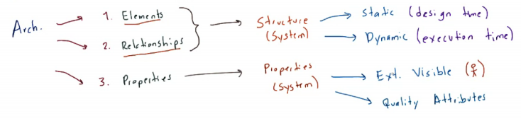
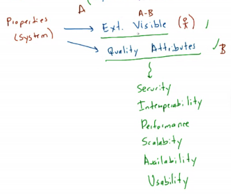

# Clase 2021-03-02

Arquitectura:

1. Elementos
2. Relaciones
3. Propiedades

- Primero pensar en las estructuras y luego en las propiedades.
- La ejecución de una estructura dinámica puede ser por partes o en su totalidad.
- Atributos de calidad
  - Seguridad
  - Interoperabilidad
  - Escalabilidad
  - Disponibilidad
  - Usabilidad
  - Rendimiento
  - ...

  

## Tarea

- Pensar en un sistema
- Ejemplo de
  - Estructura estática
  - Estructura dinámica
  - Ext. Visible
  - Atributos de calidad