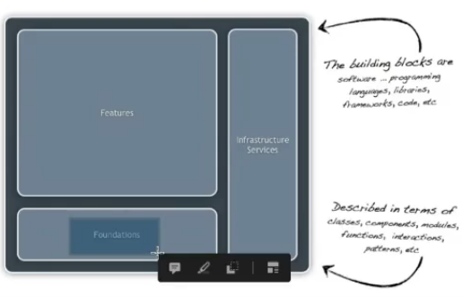
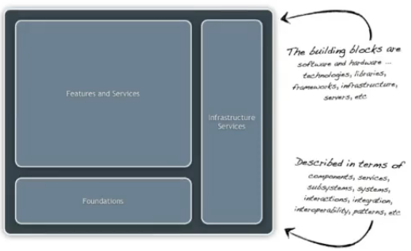
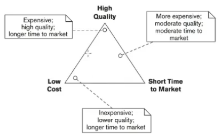
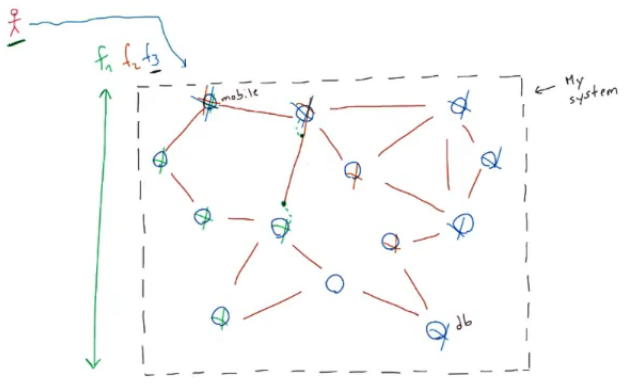
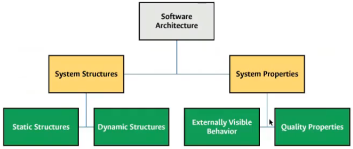

# Clase 2021-03-02
## Diferentes definiciones de arquitectura de software

- Introducción breve de libros de la Bibliografía

- **Fundamentos:** bases conceptuales
- **Características:** lo que puede hacer la caja
- **Servicios de infraestructura:** Hardware para que las características sean utilizadas
- El diseño no es tán específico pero si lo necesario para definir el bloque de construcción.

- aplica hardware directamente
- Cubre lo menos abstracto, empieza el diseño detallado

Aruitectura de software = arquitectura de la aplicaciíón + arquitectura del sistema

- Calidad del software
- Tiempo en el mercado:
  - Tiempo que se tarda en contruir
  - Tiempo que se mantiene luego del despliegue
- Bajo Costo
- El triángulo debe mantener un equilibrio entre las 3 características
- Los 3 aspectos dependen much de la arquitectura de software

- La **estructura** está conformado por **elementos relacionados**
- Nodo:: Componente
- Arco:: Conector
- Cada elemento y relación tienen características definidas
- El sujeto utilizará **funcionalidades** que manipularán algunos elementos, se dibuja el camino sobre el grafo de forma vertical, de arriba hacia abajo.
- cada componente tiene una arquitectura interna
- Cada elemento debe cumplir con las siguientes características:
  - Responsabilidades: razón de ser
  - Frontera: No hace la tarea de otro
  - Interfaz: Medio para comunicarlo con otro.

## ADD - Architecture Description Document - Documento de descripción de Arquitectura

- Es un documento que abstrae de forma concreta los aspectos arquitectónicos asociados
- Hay diferentes formas de crearlo.
- Conjunto de representaciones adecuados, con elementos, relaciones y propiedades formalmente definidos
- Se suelen usar modelos explicativos

## Resumen

Arquitectura:

1. Elementos (arquitectónicos)
2. Relaciones (arquitectónicos)
3. Propiedades (arquitectónicos)

- **Estructura del sistema:** Pensar primero en las estructúras y luego en las propiedades.
  - Se genera con:
    - Elementos
    - Relaciones
  - Tipos:
    - **Estáticas:**
      - Tiempo de diseño
      - Cuando se construye cada pieza **SIN** ejecutarla.
      - Se da durante el proceso de programacíon
    - **Dinámicas:**
      - Tiempo de ejecución
      - Cuando se ejecutan cada una de las piezas o todo el sistema de forma completa para ver las piezas interactuando entre sí.
      - Se vé en el despliegue o periodo de pruebas
- **Propiedades del sistema:**
  - Se genera con:
    - Propiedades
  - Definidas como:
    - Lo externamente visible
      - Lo que el usuario final puede ver
      - Respuestas HTTP
      - Puede ser un usuario para cada componente, no necesariamente el final
    - Propiedades o atributos de calidad
      - Requisitos funcionales generalizados
        - Seguridad
        - Interoperabilidad: Comunicarme con otro sistema para intercambiar información
        - Rendimiento: Qué tanto procesamiento puede realizar el sistema, tiempos de respuesta, cantidad de trabajo realizado/tiempo
        - Escalabilidad: Un sistema que cresca dinámicamente
        - Disponibilidad: Que esté en operación cuando se necesite
- Primero pensar en las estructuras y luego en las propiedades.
  - ...

  

## Tarea

- Pensar en un sistema y traer un ejemplo de:
  - Estructura estática
  - Estructura dinámica
  - Propiedad externamente visible
  - Atributos de calidad