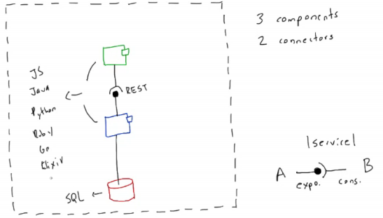
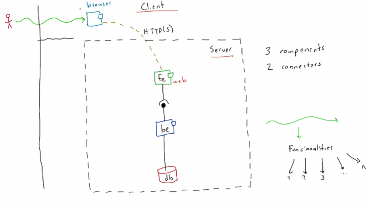
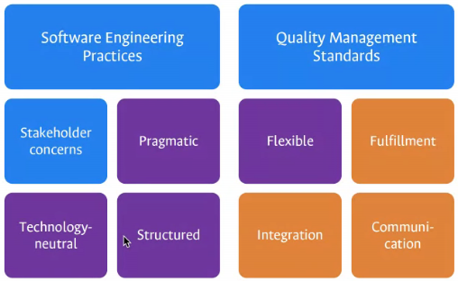
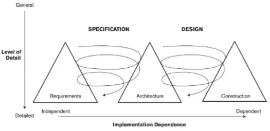

# Clase 2021-03-04

- **Servicio:**
  - Bolita: exposición
  - Arco: Consumo

- Las funcionalidades son transversales y se representan de forma vertical, de arriba hacia abajo.

## Principios Guiding

- Buenas prácticas de ingeniería de software
- Estándares de calidad: Normas, estandarización de buenas prácticas para lograr la calidad del software.
- Debe satisfacer los intereses de los Stakeholders.
- **Pragmático:** llevar a la práctica la teoría, evidencia de lo que se sabe.
- Flexibilidad: ningún sistema debe estar amarrado a una tecnología.
- Completitud: nada debe quedar por fuera, dinámica, estático ni a nivel ade atributos de calidad.
- Comunicación: Tener una visión global del sistema, desde diferentes puntos de vista
- Integración: Buenas prácticas, buenas tecnologías, fuentes de diseño para crear arquitectura más óptima.
- Estructurado: la arquitectura es una estructura, todo se ve como un conjunto de partes (Elementos, relaciones y propiedades)
- La arquitectura es tecnológicamente neutral, no depende de estos.

## Proceso de arquitectura

1. Una entrada son los requisitos
2. Definido por lo que esperan los stakeholders
3. A partir de los elementos 1 y 2, se consideran opciones arquitectónicas.
4. Con base en el paso 3, se tiene un criterío de aceptación
5. Cuando se cumplen los criterios, se tienen salidas de diseño oficiales.

Este proceso es constante y se realiza de forma paralela.