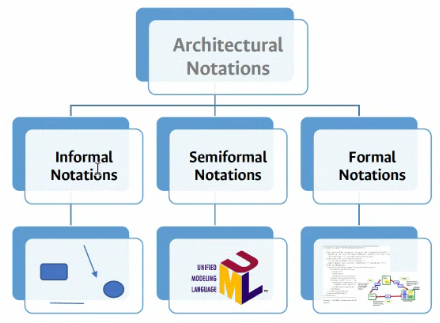
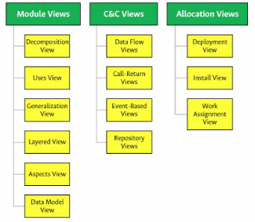

# Clase 2021-03-09

- Un sistema puede tener diferentes arquitecturas, depende de los puntos de vistas

  

- ADL - Lenguaje para describir arquitectura de software

## Vistas de Arquitectura

### Vista de descomposición

- Elementos:
  - las funcionalidades son el corazón de la vista
- Cateorizar
  - Agrupar elementos con características similares