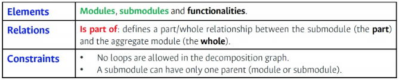
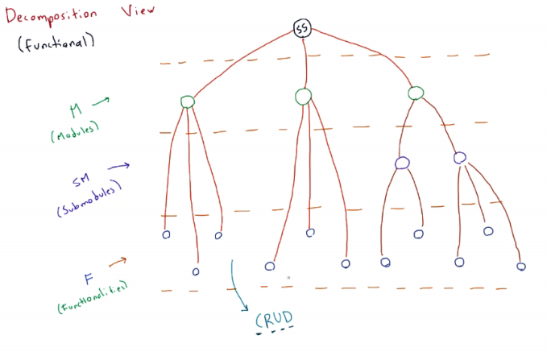
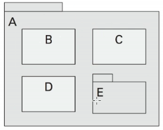
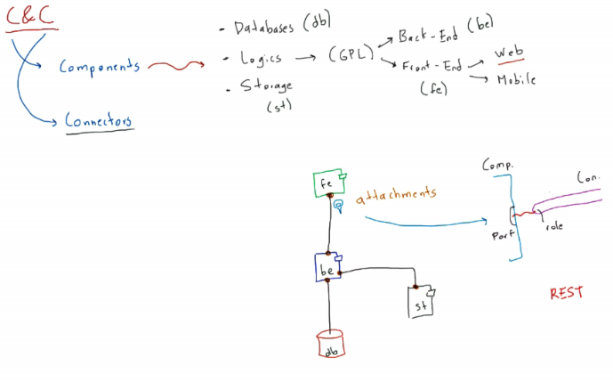

- Vista de componentes y conectores: la más importante para contemplar la estructura
- [Sarch](http://sarch-studio.net/)

## Vista de descomposición

Es una descomposición funcional del sistema. Ubicados desde el punto de vista del usuario final. El objetivo es hacer una descomposición, para ello se debe categorizar, se tratará de agrupar funcionalidades similares

- Elementos: Jerrárquico.
  - Módulos
  - Submódulos
  - Funcionalidades: el corazón de la vista
- Cateorizar
  - Agrupar elementos con características similares
- Restricciones:
  - No pueden existir loops, recursividad.
    - Un nodo no puede ser padre de su nodo superior
  - Un submódulo, sólo puede tener un padre
  - Una funcionalidad **Sí** puede tener más de un padre

Se tienen las hojas (funcionalidades), a partir de allí se empiezan a clasificar en grupos y dependiendo del sistema estos grupos se consolidarán como módulos o submódulos.

Visualizar el sistema como un arbol
- Nivel 1: Sistema de software
- Nivel 2: Módulos
- Nivel 3: Submódulos
- Nivel 4: Funcionalidades

**Relación:** Parte de, contenencia. Los nodos hijos pertenecen al padre.

La carpeta interna que tiene una pestaña, indica que esta puede ser descompuesta

Usos:
- Representar funcionalidades
- Razonar acerca de la estructura
- Permite asignar el trabajo a nivel de desarrollo.
  - Se recomienda asignar un módulo por persona
- Razonar acerca de los cambios que se pueden hacer, modificar una pieza sin afectar a las demás.

[Archivo descriptivo Sarch](https://github.com/gtzambranop/UN_2021_1/tree/develop/AS/activities/architecture.sarch)

## Vista Componentes y Conectores (C&C)

- Los elementos tienen comportamiento en tiempo de ejecución, se puede ver que tiene entradas y salidas, interactúa con otros componentes.
- Tipos de componentes:
  - bases de datos.
  - Lógicos: escritos en lenguajes de alto nivel, propósito general (java, python, JS, Ruby)
    - Back-end: Del lado del servidor
    - Front-end: Del lado del cliente
      - Web
      - Movil
  - Almacenamiento: Para almacenamiento de archivos.
- Conectores:
- Attachments: Ubicados en los puntos de contacto entre el componente y conector.

- Elementos:
- 