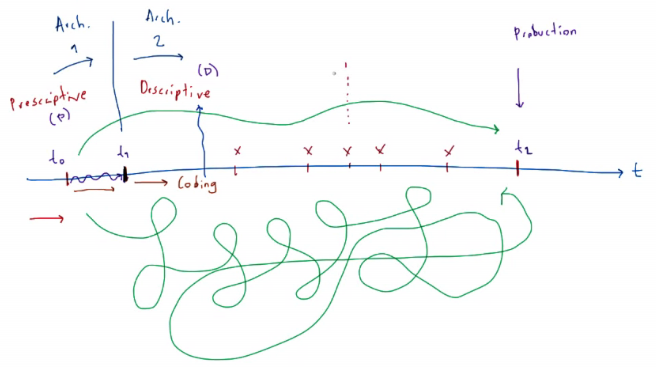
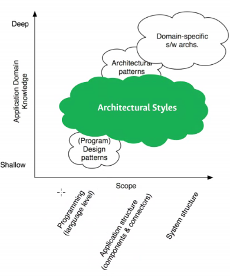
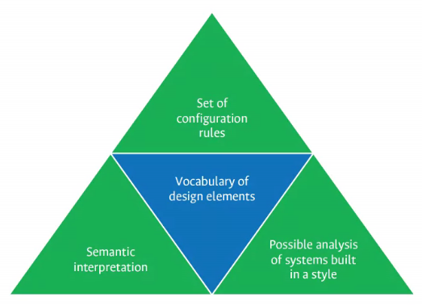
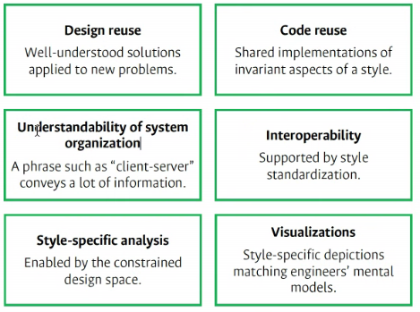
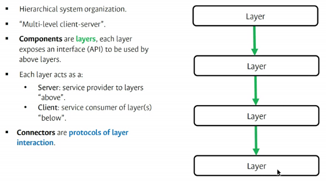
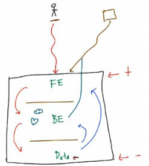

# Diseños arquitectónicos de software

## Arquitectura Prescriptiva y descriptiva

- **Arquitectura perceptiva:** Es el entendimiento o percepción del sistema en construcción, basado en el cual se toman unas decisiones de diseño.
  - Algo que se representa de forma concreta, genera un detalle alrededor de un elemento, hayun punto de referencia (algo que ya exista)
- **Arquitectura descriptiva:** Abarca la arquitectura perceptiva y además describe cómo el sistema ha sido realizado o implementado.

  

- Idea preliminar con base en la abstracción
- Idea final con base a lo que se implementó
- Prescriptivo complementario a lo descriptivo
- Se debe asociar lo descriptivo y prescriptivo
  - en algún punto del desarrollo debe coincidir lo que se ha implementado (descriptivo), con lo que se desea implementar (prescriptivo)

## Estilos de arquitectura

- No casarse con un solo estilo

  - Diseño arquitectónico máximo nivel de abstracción
  - Diseño detallado, relacionado al código fuente
  - A medida que los elementos se alejan del origen del eje x, se tiene un nivel más alto de abstracción
  - El eje y se refiere al conocimiento que se tiene del dominio
  - Los patrones de diseño es completamente diferente a patrones arquitectónicos
  - patrones de diseño, no se tiene conocimiento del dominio
- Estrategias principales
  - Estilos de arquitectura: abarca código, estructura de elementos y del sistema
  - Patrones de arquitectura: profundidad en dominio, en los elementos
- Los estilos arquitectónicos son colecciones de desiciones de diseño arquitectónico
- Cada estilo tiene una consecuencia en desarrollo.
- Ayuda a guiar características de calidad

- reglas de configuración
- analizar estructura
- Interpretación semántica: da un significado del
  - qué, funcional
  - Cömo , no funcional
- La arquitectura de software es equivalente al lenguaje, le da sentido a la comunicación
- Un estilo es un tipo de lenguaje (inglés, francés...)
  - Tiene sintáxis específica
  - Tiene elementos específicos

- Cada estilo tiene unos componentes y concetores específicos

### Layered

- El sistema se describe en capas
- Es un sistema jerárquico

  - parte de arriba, jerarquía superior, se comunica con el usuario
  - No significa que algunos elementos sean más importantes que otros
  - Implica que están más cercanos al usuario, o con otro sistema cliente
  - Datos: soporte del sistema
- El usuario final siempre va en la parte superior.

### Cliente Servidor
