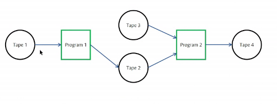
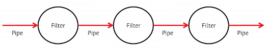
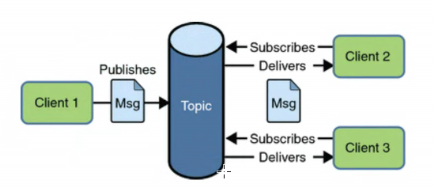
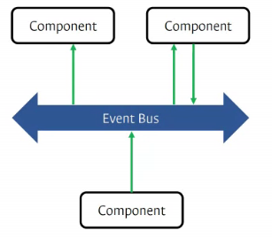
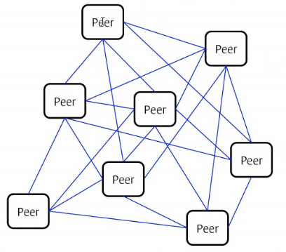
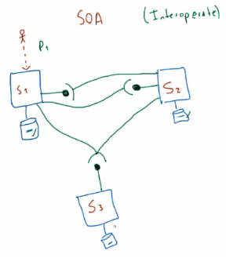
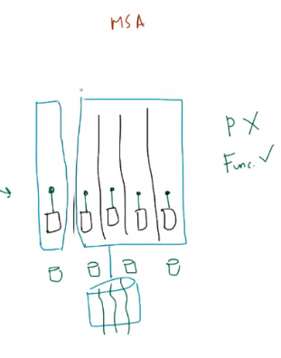

# Estilos

## Estilo de máquinas virtuales

- en cada capa se ejecutan programas independientes
- La virtualización se da en el despliegue

## Batch

- Usado por sistemas operativos a muy bajo nivel
- Permite mantener varios programas a la vez
- Elementos que funcionan secuencialmente
- Se tienen cintas que dan inicio y fin a cada programa

## Tuberías y filtros

- hacer filtros
- Un flujo de información puede pasar por diferentes programas y recibir ciertas modificaciones

## Pub/Sub

- Un elemento puede suscribirse a una notificación (tema)
- Un componente principal va a estar pendiente de los **estados** del sistema
- Los elementos que estan suscritos al componente principal,solo recibe las notificaciones
- Sirve apra tareas asincronas
- Se usan en sistemas basados en mensajería instantanea
- Los elementos conectados están pendientes de los nuevos eventos
- EL elemento muestra las notificaciones pero no conoce quiénes ni cuántos elementos están pendientes de la información

## Event-based Style

- Ele elemento principal inicia la acción
- Sabe quiénes y cuantos están suscitos a este
- El bus de eventos, cuando ocurre el evento les avisa
- Hay más sincronía

## Blackboard

- Se tiene un elemento donde se tiene toda la información
- Los clientes se conectan a este elemento
- Los clientes de escritorio se conectaban a la base de datos e imprimian lo que estaba allí
- La base de datos, datos + lógica de procesamiento

## Peer-to-Peer

- Un elemento es cliente como servidor
- Hay que tener cuidado con la seguridad
- Se pueden filtrar procesos agenos no autorizados y consumir recursos
- Ejemplo: skipe
- Las conexiones son exponenciales, se debe tener cuidado con el incremento de las mismas

## Arquitectura basada en Servicio

- Un servicio es una interfáz
- Hay un componete que expone algo
- Este compoente tiene múltiples funcionalidades y hay una de ellas que quiere exponer a nivel del componete
- El componente quiere compartir su funcionalidad
- Esa funcionalidad se asocia a una interfáz
- Se debe cuidar esa interfáz
- Elementos
    - Interfáz
    - Exposición del servicio
    - Consumo del servicio

### Arquitectura orientada a servicios - SOA

- Requiere múltiples sistemas
- Se tiene información en los diferentes sistemas
- Los involucrados son los difeentes sistemas de software
- Se debe tener un esquema en donde los esquemas puedan inter-operar
- Cada sistema expone un servicio y entre ellos lo consumen

### Arquitectura orientada a microservisios - MSA

- No se enfoca a nivel interno
- Els sistema es complejo y se subdividen sus servicios en componetes más pequeños
- Hay familias de microservicios
- Cada microservicio es tratado de forma específica
- Conectores tipo red

- WEB: Sistema de sosftware que gestiona recursos
  - URI: identificador de recursos
  - HTTP: Comunicador entre enlaces

## Entrega 2

- Separar las funcionalidades y separarlo en componetes pequeños
- Se pueden usar las tecnologías elegidas