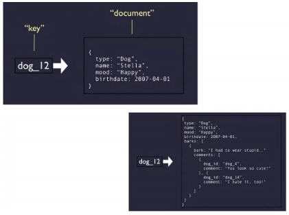

## Almacenamiento No SQL

- al inicio se basa en el principio de diccionario
- Se usa una estructura de diccionario con búsquedas por medio de hash
- la Base de Datos **NO** es entendible
- Llave de valor
  - Basadas en documentos
    - Es un poco más organizada
    - El valor tiene una estructura, usualmente tipo Json

        
    - MongoDB, CouchDB