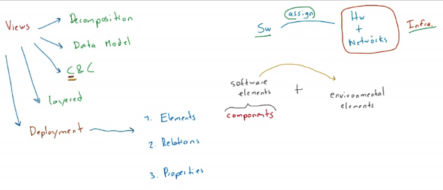

# Clase 2021-04-22

- **Vistas:**
  - **Descomposición:** enfoque funcional
  - **Modelo de datos:** a nivel de datos
  - **C&C:** ELementos en tiempo de ejecución transversales a la vista de descomposición.
  - **Capas:** Describe aspecto referentes a componentes y conectores, describe sub-arquitecturas
  - **Despliegue:** Se tiene en cuenta los componentes
    - Componentes -> Elementos de software

  

## Vista de Despliegue

- **Despliegue:** asigna el software en una Infraestructura

