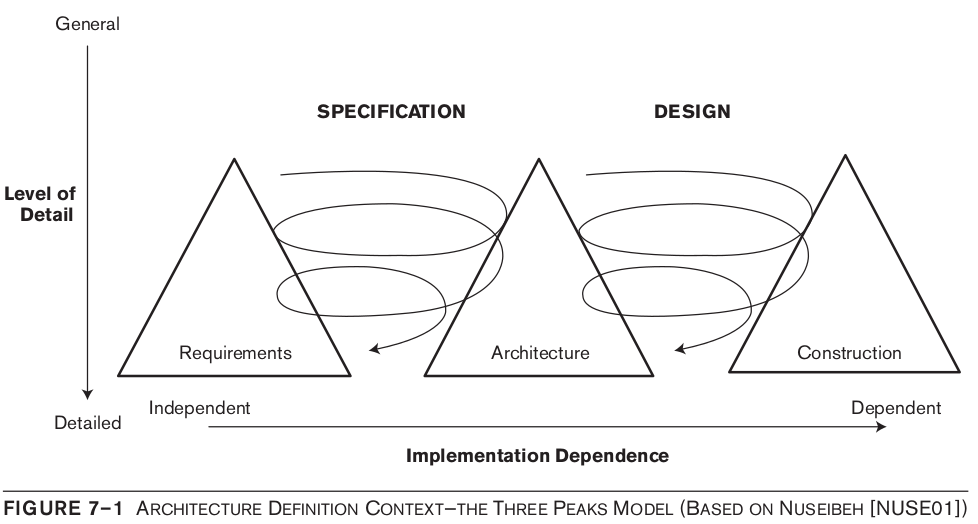
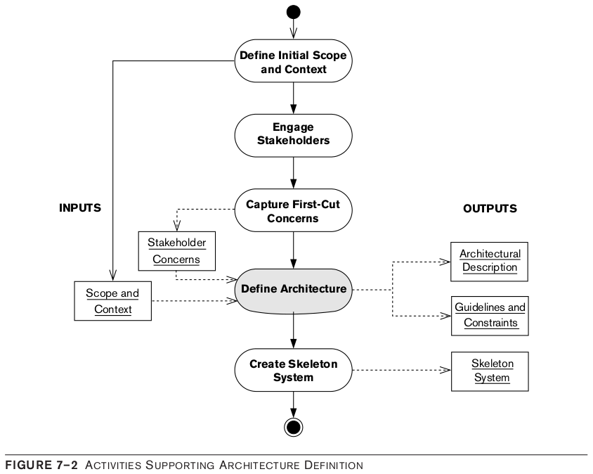
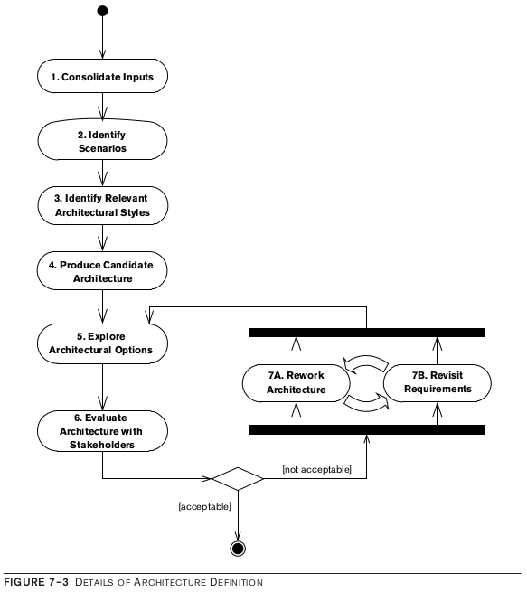
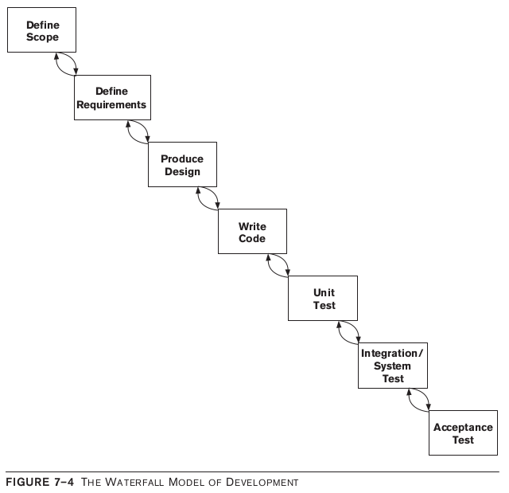
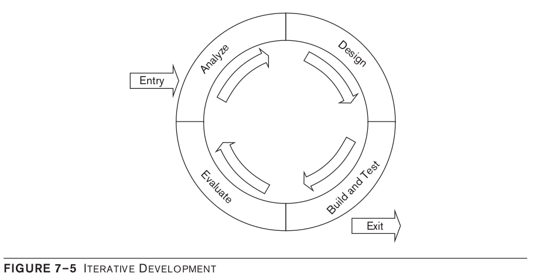

# El proceso de definición de arquitectura

- [Lectura](../readings/01.pdf)

La definición de la arquitectura comienza temprano en el ciclo de vida del proyecto, cuando el alcance y los requisitos a menudo aún no están claros y la visión actual del sistema puede diferir sustancialmente de lo que finalmente se construye. Por esta razón, la definición de la arquitectura tiende a ser una actividad más fluida que las tareas posteriores, como diseñar, construir y probar, cuando se comprende mejor el problema que está resolviendo.

## Principios Guiding

Para que un proceso de definición de arquitectura sea exitoso, debe adherirse a los siguientes principios:

- Debe estar impulsado por las preocupaciones de las partes interesadas, estas son la base, pero de ninguna manera la única aportación al proceso. Además, el proceso debe equilibrar estas preocupaciones de manera eficaz cuando entren en conflicto o tengan implicaciones incompatibles.
- Debe fomentar la comunicación efectiva de las decisiones arquitectónicas, los principios y la propia solución a las partes interesadas.
- Debe garantizar, de forma continua, que se cumplan las decisiones y los principios de arquitectura durante todo el ciclo de vida hasta la implementación final.
- Debe (en la medida de lo posible, dada la naturaleza fluida de la definición de arquitectura) estar estructurado. En otras palabras, debe comprender una serie de uno o más pasos o tareas, con una definición clara de los objetivos, entradas y salidas de cada paso. Normalmente, las salidas de un paso son las entradas a los pasos posteriores.
- Debe ser pragmático, es decir, debe considerar problemas del mundo real como falta de tiempo o dinero, escasez de habilidades técnicas específicas, requisitos poco claros o cambiantes, el contexto existente y consideraciones políticas.
- Debe ser flexible para que pueda adaptarse a circunstancias particulares.
- Debe ser neutral desde el punto de vista tecnológico. Es decir, no debe exigir que la solución se base en una tecnología, patrón arquitectónico o estilo de desarrollo específicos, ni debe dictar ningún estilo de modelado, diagramación o documentación en particular.
- Debe integrarse con el ciclo de vida de desarrollo de software elegido.
- Debe alinearse con las buenas prácticas de ingeniería de software y los estándares de gestión de la calidad (como ISO 9001) para que pueda integrarse fácilmente con los enfoques existentes.

## Resultados del proceso

algunos resultados secundarios deseables o consecuencias de la definición de arquitectura, como:

- *Aclaración de los requisitos y de otras entradas al proceso:* Es posible que sus partes interesadas no tengan absolutamente claro lo que quieren, y puede llevar algún tiempo precisarlos.
- *Gestión de las expectativas de las partes interesadas:* su arquitectura inevitablemente necesitará hacer concesiones en torno a las preocupaciones de las partes interesadas. Es mucho mejor hacer que estos compromisos sean visibles y claramente comprendidos al principio de la vida del proyecto que dejarlos emerger más tarde.
- *Identificación y evaluación de opciones arquitectónicas:* Rara vez existe una sola solución a un problema. Cuando hay varias soluciones potenciales, su análisis revelará las fortalezas y debilidades de cada una y justificará la solución elegida.
- *Descripción de los criterios de aceptación de la arquitectura (indirectamente):* la definición de la arquitectura debe conducir a una comprensión clara de las condiciones que deben cumplirse antes de que las partes interesadas acepten que la arquitectura se ajusta a sus requisitos (por ejemplo, debe proporcionar una función particular, lograr ciertos tiempos de respuesta o reiniciar en menos de un período de tiempo determinado).
- *Creación de un conjunto de entradas de diseño (idealmente):* información como orientación y restricciones en el proceso de diseño de software ayudará a garantizar la integridad de su arquitectura.

## El contexto del proceso

La arquitectura forma el puente entre los requisitos y el diseño, realizando las compensaciones necesarias para satisfacer las demandas de ambos. En términos de proceso, esto significa que la definición de la arquitectura se encuentra entre el análisis de requisitos y la construcción del software (diseño, código y prueba).

Los tres triángulos (los picos) en el diagrama representan las principales actividades de desarrollo de software de análisis de requisitos, definición de arquitectura y construcción; el ensanchamiento de las formas en sus bases representa un nivel de detalle creciente a medida que pasa el tiempo mientras se desarrolla el sistema. Las flechas curvas muestran cómo los requisitos y la arquitectura, así como la arquitectura y la construcción, se entrelazan a un nivel de detalle cada vez mayor durante el desarrollo del sistema.

Existen las siguientes relaciones clave entre la arquitectura del software y los requisitos y las actividades de construcción del ciclo de vida del software:

- El análisis de requisitos proporciona el contexto para la definición de la arquitectura al definir el alcance y la funcionalidad deseada del sistema y las propiedades de calidad.
- La definición de la arquitectura a menudo revela requisitos inconsistentes y faltantes y también ayuda a las partes interesadas a comprender los costos relativos y las complejidades de satisfacer sus inquietudes. Esto se retroalimenta en el análisis de requisitos para aclarar y agregar requisitos y priorizarlos cuando se hacen concesiones entre las aspiraciones de las partes interesadas y lo que se puede lograr dadas las limitaciones de tiempo y presupuesto.
- Cuando la definición de la arquitectura ha dado como resultado una arquitectura que parece cumplir con un conjunto aceptable de requisitos de usuario, se puede planificar la construcción del sistema.
- La construcción a menudo se organiza como un conjunto de entregas incrementales, la construcción de cada incremento proporciona información adicional a la definición de la arquitectura, validando o indicando problemas con la arquitectura tal como se especifica actualmente; por lo tanto, existe una actividad de definición de arquitectura a lo largo del ciclo de vida.

## Actividades de Apoyo

Elementos base, considerados disponibles:

- Una definición del contexto y el alcance de referencia del sistema
- Una definición de las preocupaciones clave de las partes interesadas

El diagrama de actividad de UML ligeramente extendido en la Figura muestra cómo la definición de la arquitectura se relaciona con las siguientes actividades de soporte.

- Defina el alcance y el contexto iniciales.
- Involucrar a las partes interesadas.
- Capte las preocupaciones del primer corte.
- Definir la arquitectura.
- Crea un sistema de esqueleto.

Los cuadros cuadrados con nombres subrayados representan entradas y salidas clave del proceso.

## Actividades de definición de arquitectura

El proceso de definición de arquitectura es iterativo.

El diagrama de actividad de UML de la Figura ilustra nuestro proceso, que incluye los siguientes pasos:

1. Consolide las entradas.
2. Identificar escenarios.
3. Identificar los estilos arquitectónicos relevantes.
4. Producir una arquitectura candidata.
5. Explore las opciones arquitectónicas.
6. Evaluar la arquitectura con los stakeholders.
7. Conjunto:
   1. Rehacer la arquitectura.
   2. Revise los requisitos.

## Criterios de Salida del proceso

La definición de la arquitectura se puede considerar completa una vez que la revisión formal de la descripción arquitectónica por parte de las partes interesadas no genera comentarios o acciones importantes.

Inclúyase en los revisores de la descripción arquitectónica y no termine la definición inicial de la arquitectura hasta que esté satisfecho de que no hay problemas importantes con la arquitectura.

Intente producir una descripción arquitectónica que sea lo suficientemente buena para satisfacer las necesidades de sus usuarios, en lugar de esforzarse por obtener una versión perfecta que requerirá significativamente más recursos para completar sin proporcionar ningún beneficio real a las partes interesadas del sistema.

## Definición de arquitectura en el ciclo de vida de desarrollo de software

La arquitectura no reemplaza el ciclo de vida normal del desarrollo de software, sino que debe considerarse como una parte integral del mismo.

### Enfoques de cascada

En el modelo clásico en cascada, el desarrollo de software se ve como una secuencia lineal de tareas, con cada tarea usando los resultados de la anterior como entradas y alimentando la siguiente tarea a su vez, como se muestra en la Figura

### Enfoque iterativo

La motivación detrás de los enfoques iterativos es reducir el riesgo mediante la entrega temprana de funcionalidad parcial, como se muestra en la Figura, cada iteración generalmente se enfoca en un área que presenta un riesgo significativo porque sus requisitos no están claros, la definición de la arquitectura formaría parte de la fase de análisis o, alternativamente, podría ejecutarse junto con las otras tareas como una actividad continua.

### Métodos ágiles

Los métodos ágiles son métodos ligeros que se centran en la entrega rápida y continua de software a los usuarios finales, fomentan la interacción constante entre el cliente y los desarrolladores de software, y tratan de minimizar la sobrecarga de gestión del proceso de desarrollo. La arquitectura encaja por encima de los incrementos de construcción, establece el contexto para las iteraciones y ayuda a mantener la coherencia y la integridad técnica en todo el sistema.