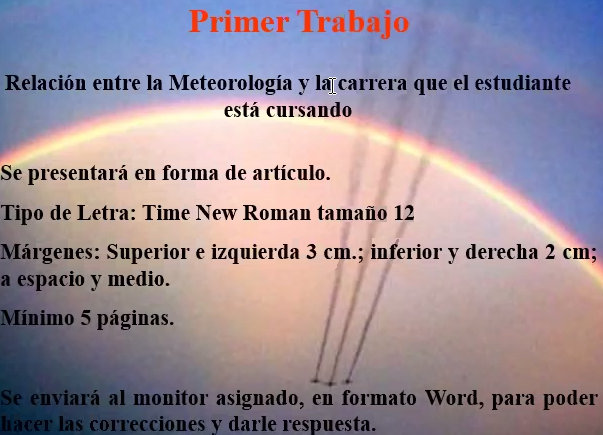
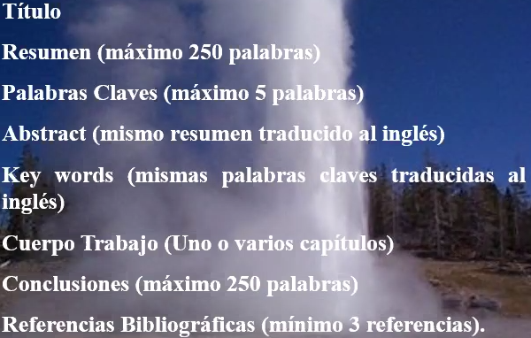
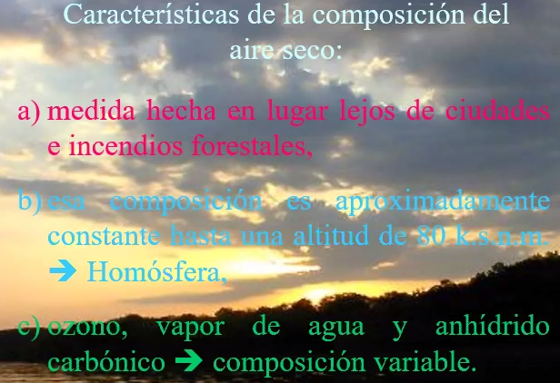

# Clase 2021-03-08

- metereologíaciencia que estudia fenomenos físicos y quimicos en la atmosfera terrestres
- atmosfera: envoltura que rodea el globo terraqueo
- Aire dificil de observar, se puede percibir de forma indirecta (viento)
- Fenómenos físicos en la atmosfera:
  - Relámpagos, cargas electricas. Acumulación de energía en las nubes
  - Halo
  - Arcoiris
  - Corona
  - Nieve: Interactúa con el sistema terrestre
- Ramas

  

  - Metereología: tiempo
  - Climatología: clima
  - Metereología sinóptica: Se emplea para realizar el pronostico del tiempo, con base en estudios físicos y dinámicos
- Relaciones de enfermedades y fenómenos atmosféricos

  

- Terminos básicos

  

  

  - **Evento metereológico:** Pueden ser medibles con elementos metereológicos y no se dan todo el tiempo: LLuvia, niebla... Se forman por cambio metereológicos, cambios de temeperatura, de presión. Algunos son más faciles de medir que otros

  

  

  

  

  

  

  - La presión atmosférica, cambia co la altura (disminuye), no podríamos respirar arriba.