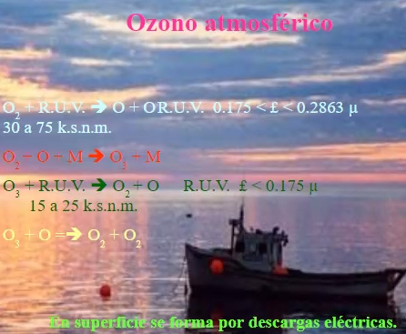
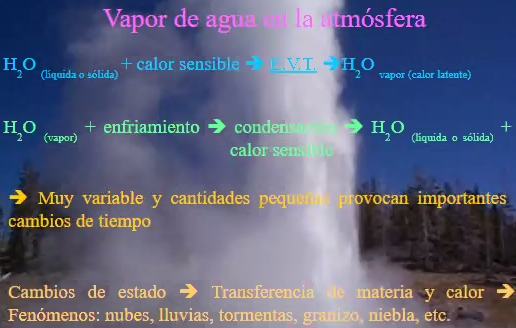
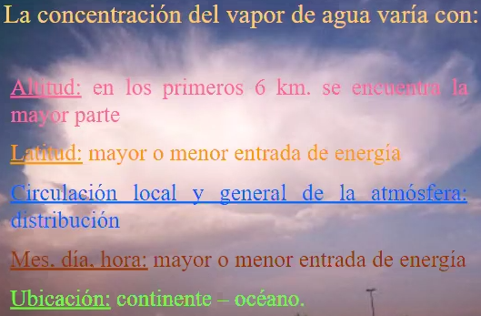
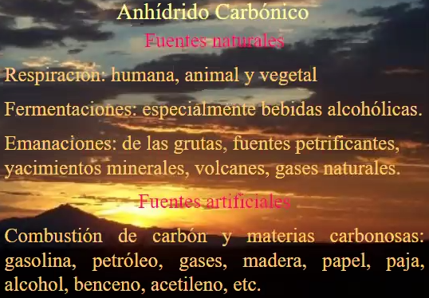
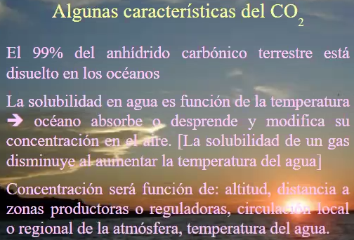
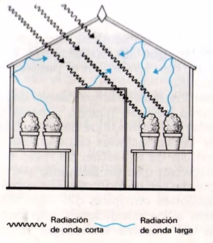

# Clase 2021-03-10

Ozono atmosférico

- Más alllá de 25km
- a nivel del mar se ve cuando hay descargas eléctricas, ese ozono reaccina y se descompone
- mayor ozono en el día
- absorbe radiación y permite la vida

- A más altura menos vapor de agua
- el vapor de agua, produce cambios en el tiempo

- radiación onda corta: transmitida por el sol por ejemplo
- Radiación de onda larga: emitida por superficies

- Radiosondeo: los instrumentos se transladan en altura
- Globo-terraqueo: solo toma datos a ciertas alturas