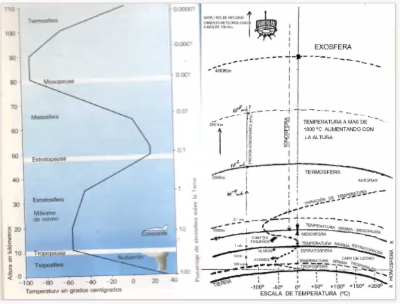
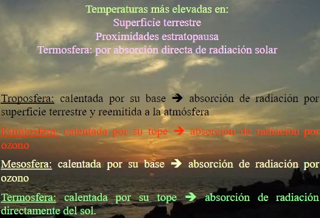
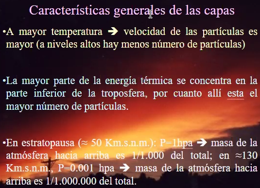
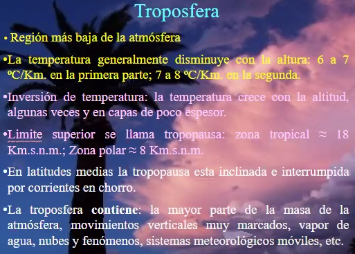

# CLase 2021-03-17

- troposfera mecanismos conocidos y estudiados
- la temperatura crece y decrece a medida que se aumenta la altura

- mayor temperatura -> mayor cantidad partículas

No a la misma altura en todo el globo