# Radiación y cambios de energía

- el sol emite radiación en longitud de onda corta
- Ciclónico: se centra en un punto
- radiación no esconstante, por rotación y traslación de la tierra, el área de contacto es diferente

  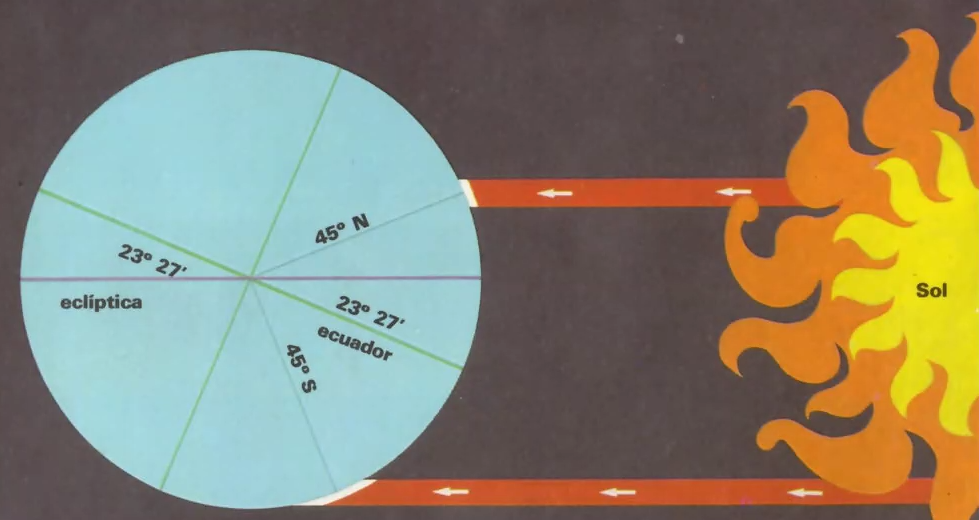

- noche polar, al polo sur no le llega radiación

  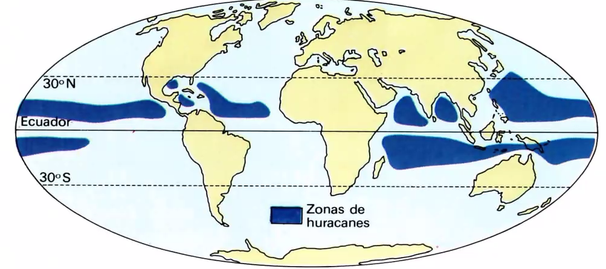

- Huracanes en sitios constantes, tornados en lugares variados
- Tifón(india) = Huracán(América)

  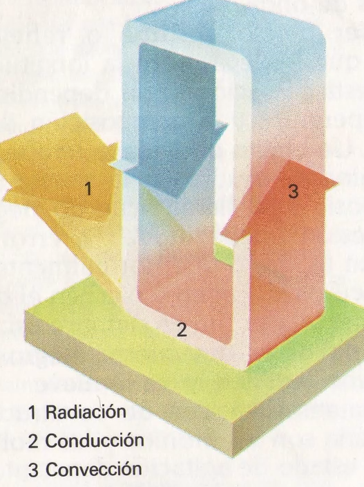

  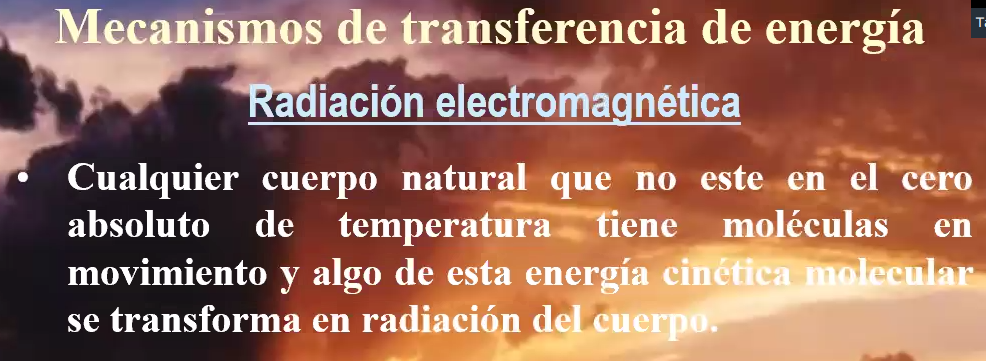

  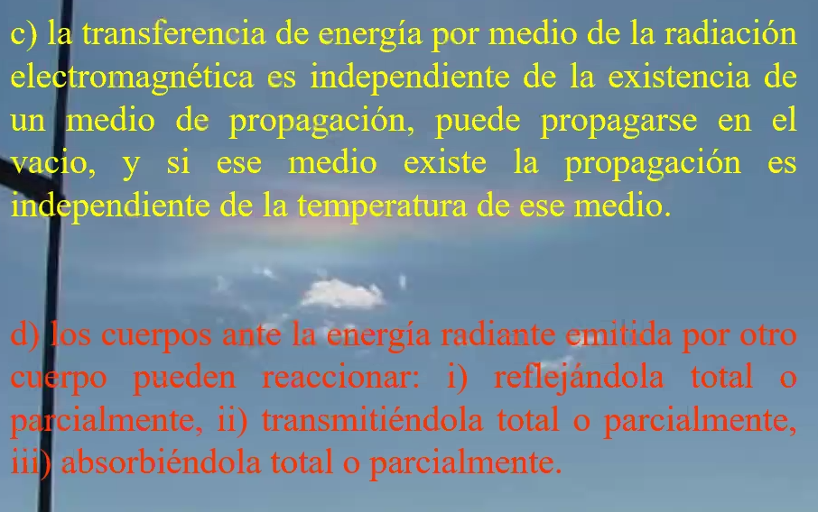

- Cuerpo negro: ideal, no existe en la naturaleza

  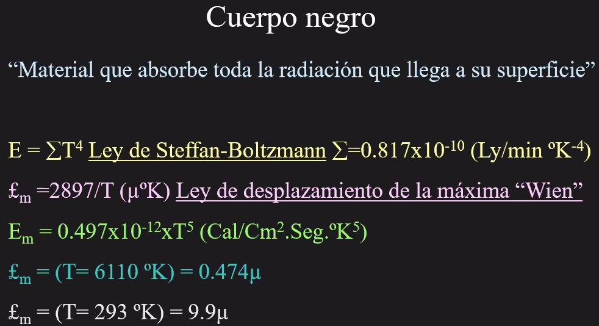

  - la energía de un cuerpo se puede calcular por la ley de Steffan
  - la tierra emite en onda larga
- Conducción molecular. El calor o energía pasa de un cuerpo más caliente a uno más frío, no hay transferencia de masa.

  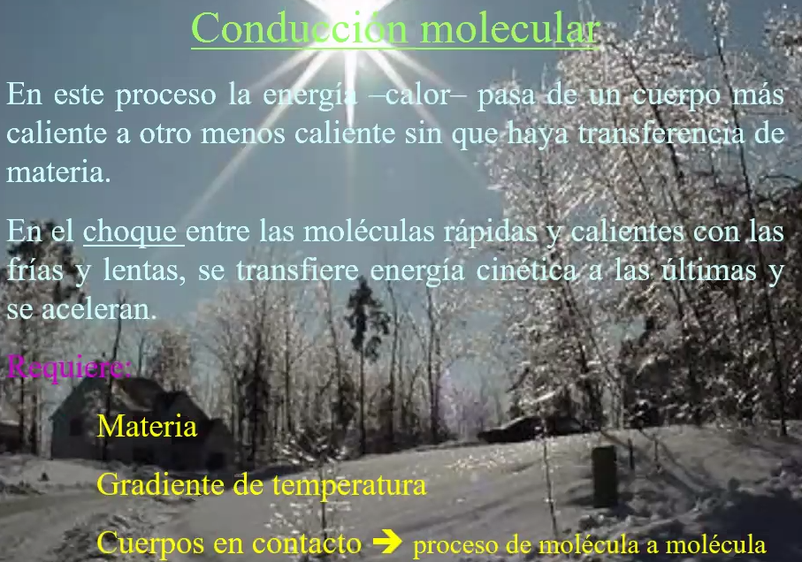

  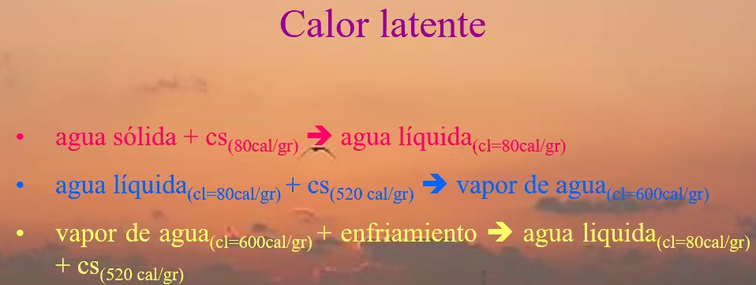

  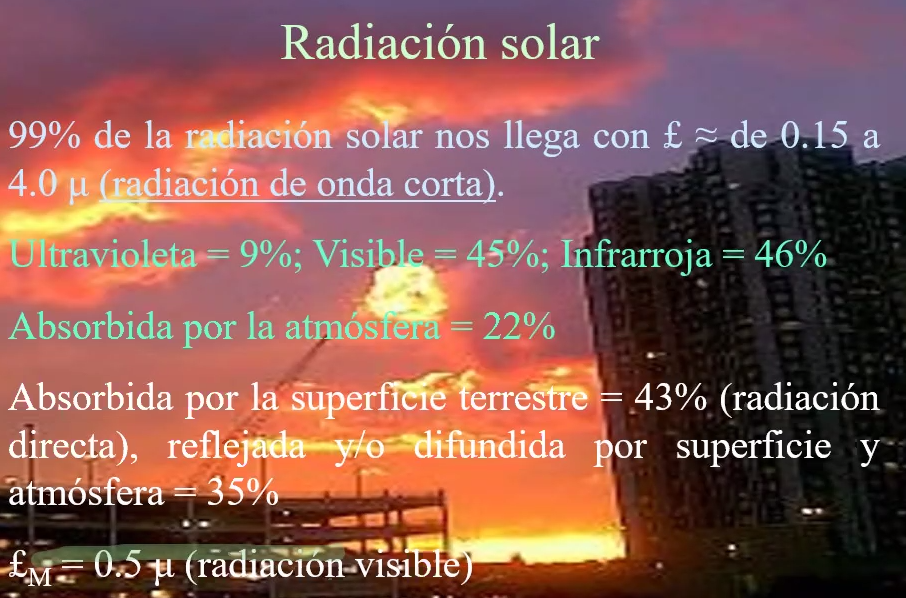

  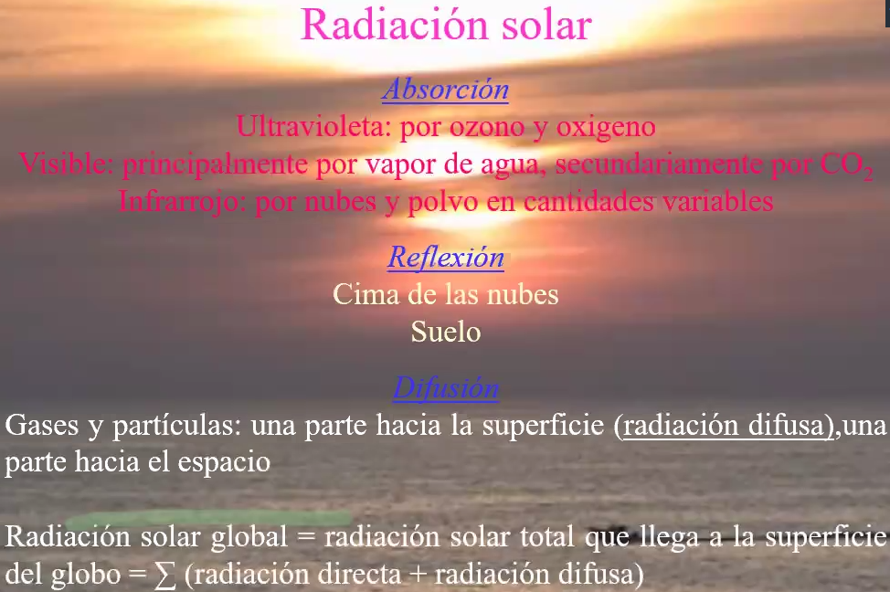

- Radiación terrestre: longitud larga, en infrarrojo

  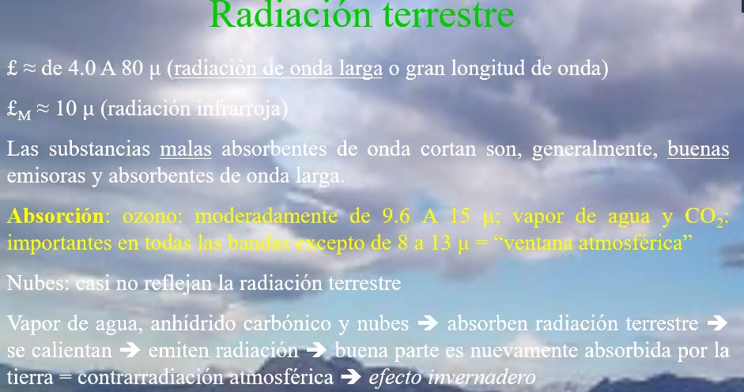

  - las nuves no reflejan radiación terrestre, pero si parte de la solar

  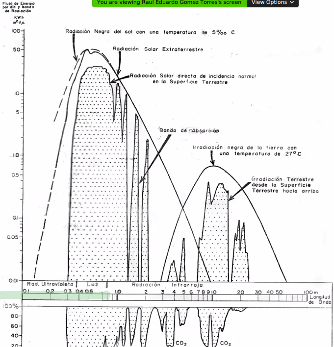

  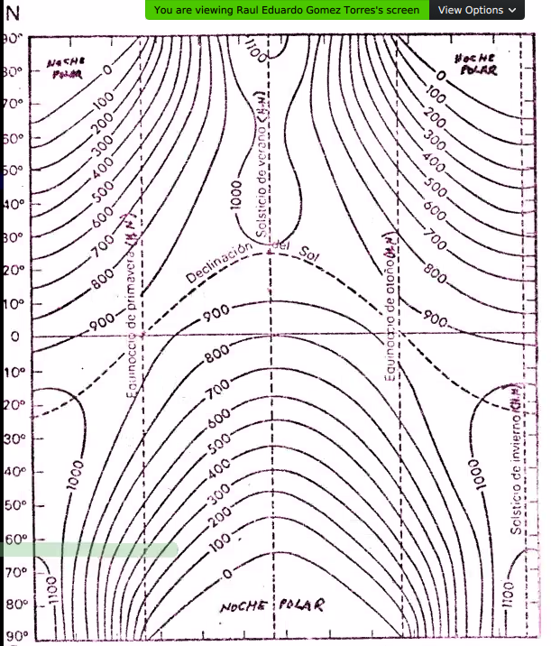

  - la radiación no es constante para todo el globo
  - 21 de Enero sol posición más al sur
  - 21 junio, posición máas al norte
  - Equinoccsio de primavera(mayo) y otoño(sep) - Opuestos -> solsticios(jun-dic)