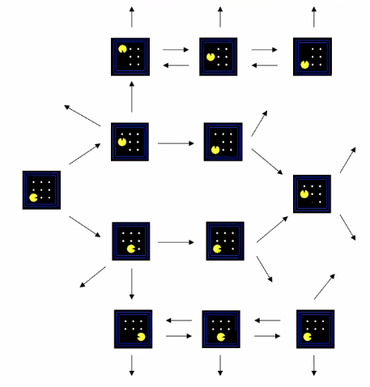

## Agentes que planean

## El agente Reflejo

- el reflejo puede ser la estrategia más racional.
- Conocen el mundo cómo es, no saben cómo repercuten sus acciones ni sabe cuáles acciones ha realizado
- Es racional

## Problemas de Busqueda

- Espacio de estado: $2^8 \cdot 9 \cdot 4$
- Función sucesor:
  - Muestra el estado inicial y los posibles estados a los que tiene acceso
  - Muestra el costo
  - El estado inicial y el estado objetivo
  - prueba de meta: evalua si llega al estado objetivo
- La solución es una secuencia de acciones que permiten llegar al estado objetivo
- **Ejemplo:**

  

  - espacio de estados: ciudades
  - Función sucesor:
    - Ciudad a la que se dirige
    - Costo del viaje
  - Estado inicial: Arad
  - Goal test
    - Is state == Bucarest

- **Ejemplo 2:**

  

  - Pacman sabe dónde están los fantasmas, ya que ellos saben dónde está el.
  - Pacman sabe dónde están las galletas y su tipo

### Grafos

- El espacio de estados se pueden ver como un grafo

  

  - Cada estado es un nodo del grafo
  - Los arcos representan las acciones

### Árbol de busqueda

  - En el modelo empleando árboles no se cumple que:
    - Cada estado es un nodo, ya que estos pueden ser repetitivos
  - Un árbol de búsqueda muestra posibles planes, pues los estados a los que se puede acceder desde la raíz.
  - los nodos representan un planes
  - Generalmente no se dibuja todo el arbol, solo parcialmente
  - El árbol de búsqueda del siguiente grafo es infinito:

    

# Tarea

- Ver video de búsqueda
- Leer capítulo del libro
  - Opcional
  - Busqueda no informada
  - 63-84