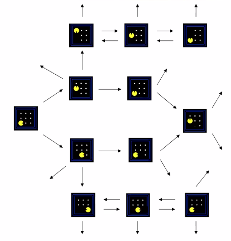
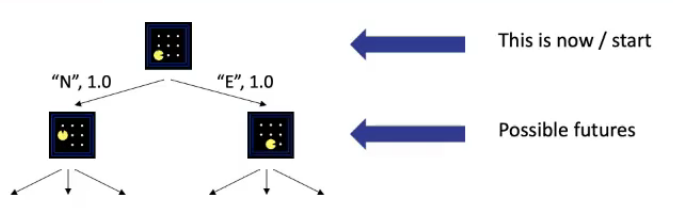
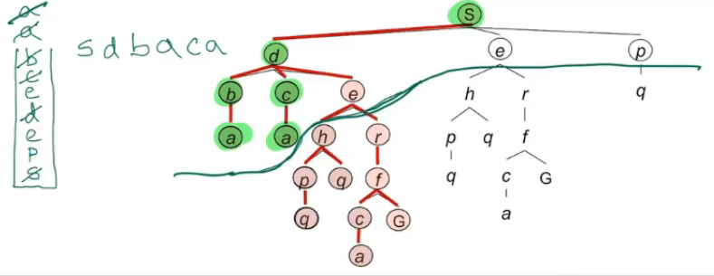
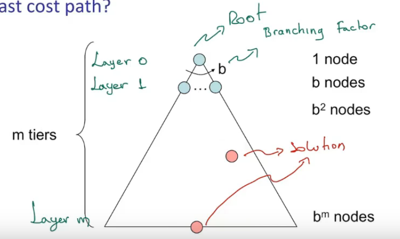
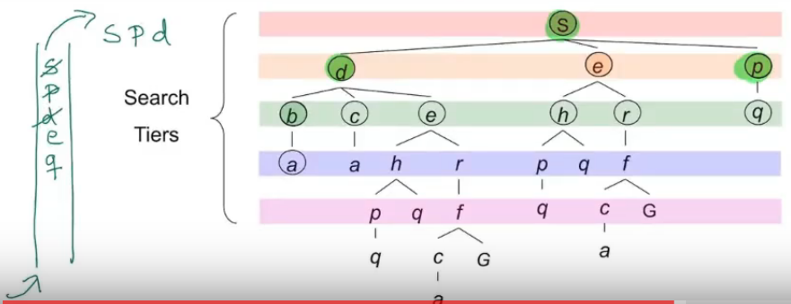
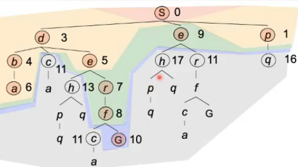
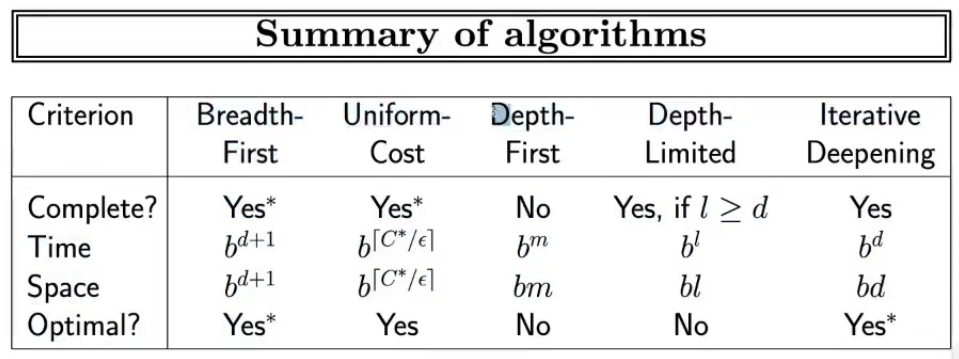

# Clase 2021-03-08

[Video de la clase](https://drive.google.com/file/d/1hxerUmA98tGmbXNyghmE9qQnxSKTkoAG/view?usp=sharing)

## Recapitulación

Un problema de búsqueda consiste en los elementos:
- Espacio de estados: estados en los que puede estar el mundo
- función sucesor:
  - efecto de las acciones en el ambiente
  - dice el costo de cada acción
- Estado de inicio
- Test de objetivo

La solución es una secuencia de acciones que de un estado inicial, permite llegar a un estado objetivo

En el estado, solamente modelar las cosas que cambian cuando se ejecutan acciones.

**Grafo del espacio de estados:**

- El grafo no se representa usualmente de forma explícita. Consume mucha memoria.
- Los estados solo ocurren una vez

**Árbol de búsqueda**

- Muestra los pasos, las posibles acciones en secuencia.
- Los estados pueden ser representados más de una vez
- Usualmente no se exploran de forma explicita

## Algorítmos de búsqueda

- Se tiene una estructura con nodos candidatos a expandir
- se saca el nodo inicial, se expande, se obtienen los sucesores
- Por medio de un criterio, se elige a cuál hijo expandir

### Algoritmo general

- Se tiene una estructura de datos que contiene el árbol de búsqueda
- bucle:
  - Error: No candidato, no solución
  - Otro:
    - Se escoje candidatos de acuerdo a una **estrategia** (puede cambiar)
    - Se expande y los nodos se añaden al árbol de búsqueda.

### Búsqueda en profundidad

- La frontera son los que estan en un moemnto dado en la estructura de datos
- Pila LIFO (El primer elemento en entrar es el último en salir)

La frontera son e, e y p. Estos se encuentran en la PILA

### Propiedades del algorítmo de busqueda

- **Completo:** garantiza si una solución existe, la encuentre
- **Óptima:** Encuentra el camino de menos costo
- **Complejidad:**
  - Temporal: Cuánto tarda en encontrar la solución
  - Espacial

Elementos de un árbol:

- Raíz
- $b$ - Factor de ramificación (branching factor): Número de hijos que puede tener un nodo.
- $m$ - máxima profundidad: Hasta donde se va a explorar
- Las soluciones pueden estar a diferentes profundidades
- En notación asintótica, la función está acotada superiormente por $O(b^m)$

### Búsqueda en amplitud

- Expande al menos profundo primero
- Usa una cola FIFO (El primer elemento en entrar es el primero en salir)
- Explora por niveles
- Es óptimo si los costos son iguales

### Busqueda en profundidad iterativa

- Busqueda en profundidad limitada, se le indica hasta cuál nivel puede hacer una búsqueda en profundidad.
- Se debe reiniciar la busqueda cada vez que se varíe la profundidad máxima
- No es trabajo desperdiciado, ya que los primeros niveles no consumen tanto tiempo ni espacio.

## Búsqueda de costo uniforme

- Similar a la búsqueda en amplitud, pero se tienen en cuenta los costos
- Se usa una **Cola de prioridad** (Estructura que retorna el elemento con máximo costo o con mínimo costo)
- Retorna el nodo con menor costo (acumulado)
- Recorre el árbol por regiones del mismo costo
- Es lo mejor cuando no se tiene información adicional
- Es completa y óptima
- **Problema:** Hace una búsqueda en todas las direcciones

## Propiedades de métodos de búsqueda

