# Clase Virtual 2021-03-15

- [Video 1](https://drive.google.com/file/d/1oTtFMYrqQECkB_XfkYpsZItmpyWqfTIL/view?t=780)
- [Video 2](https://drive.google.com/file/d/1ATKLXE2cxSo8YXuklzXAU6aI7OLvSvGy/view?t=15)

## Recapitulación Busquedas convensionales

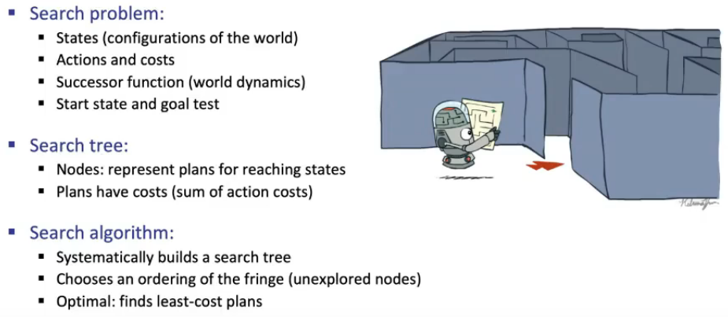

- El árbol es una estructura que se crea a medida que avanza el código
- Cada nodo sabe cuál es su padre
- Cada nodo representa un plan, una secuencia de pasos con costos

## Busquedas Informadas

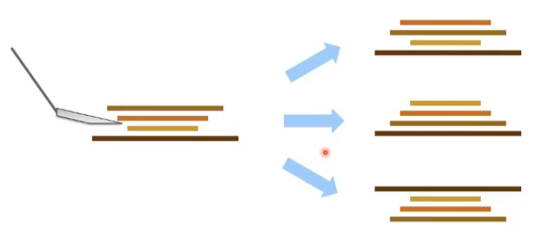

- n pancakes, n-1 acciones posibles.
- n pancakes, se pueden organizar de n!
- Costo: número de pancakes bolteados
- objetivo: secuencia de acciones de costo mínimo

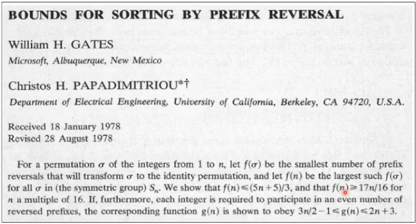

- cota superior: (5n + 5)/3
- Cota inferior: 17n/16
- La búsueda de costo uniforme, busca en todas las direcciones

## Heurística - h(x)

- Es una función que estima que tan cerca estamos de un estado a un estado objetivo
- **Distancia euclidiana - L2:** hipotenusa, no es exacta para el pacman porque no corre en diagonal.
- **Distancia de manhatan - L1:** suma del tamaño de aristas
- Es fácil de calcular
- El número del pancake más largo, fuera de lugar
- la heurística cambia a partir del estado inicial.

##  Greedy Search

- Algoritmo voraz, seguir la heurística óptima para cada paso.
- Se va a lo que tiene más cerca

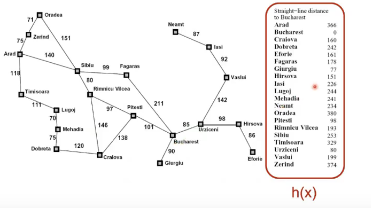

- h(x): distancia lineal
- La cola de prioridad está ordenada con base en la función heurística
- La búsqueda voráz, encuentra la solución, pero no siempre es la más óptima

## A*

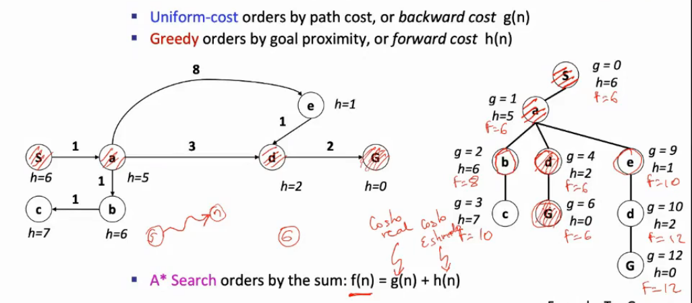

- Combinanción:
  - **Búsqueda de costo uniforme UCS:** lento y garantiza el óptimo, tiene en cuenta costos reales. g(n)
  - **Voráz - Greedy:** No garantiza el óptmo, solo tiene en cuenta la heurística. h(n)
- f(n) = g(n) + h(n)

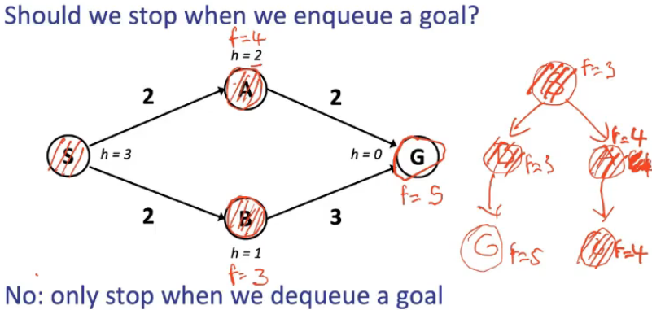

- Termina cuando saca un nodo del **fringe** y ese nodo es **objetivo**
- Es óptimo sólo si las heurísticas **NO sobrestima**
- **inadmisible:** buenos caminos quedan en fringe por la mala heurística
- **admisible:** los malos caminos son retrasados por la heurística

  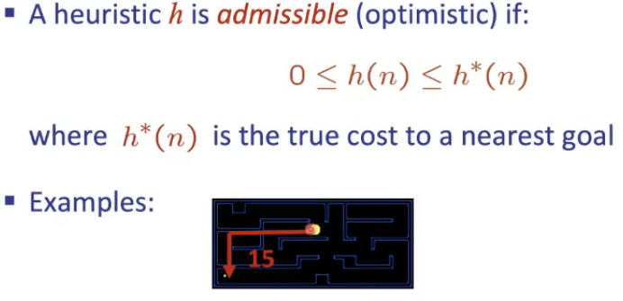

- h*(n) es el costo real que generalmente no se sabe

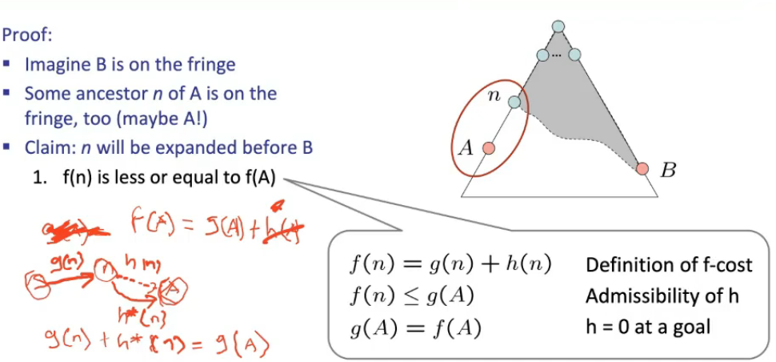

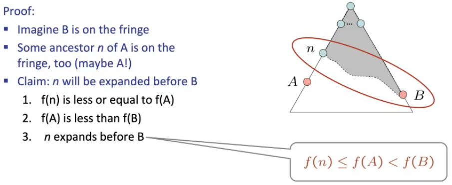

- Los antepasados de A, se expanden primero que B.
- A va a ir al fringe y va a ser sacado primero  que B

## Segunda parte

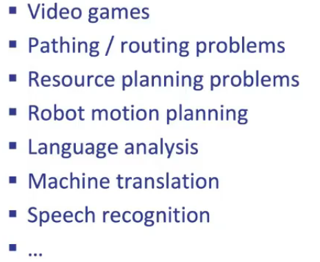

- Procesamiento de voz: modelos probabilisticos

### ¿Cómo crear las heurísticas adminisbles?

- pensar en versiones más simples (relajadas) del problema.
- mapa -> viajar en avión, pacman -> atraviesa paredes
- las heurísticas inadmisibles podrían llegar a ser úties, no la optima pero sí una solución
- Ejemplo Puzzle
  - Cantidad de estados: 9!
  - acciones: mover el espacio en blanco
    - Arriba, abajo, izquierda y derecha
  - sucesores del estado inicial: 4
  - Heuristicas
    - Número de fichas fuera de lugar
      - Admisible: sí
      - Version relajada: sacar las fichas y ponerlas en su posición

    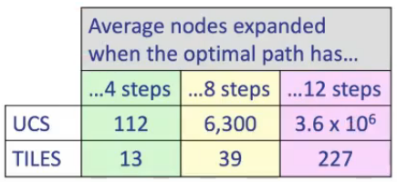

    - contar los pasos de manhatan para cada pieza del puzzle y sumar el total

    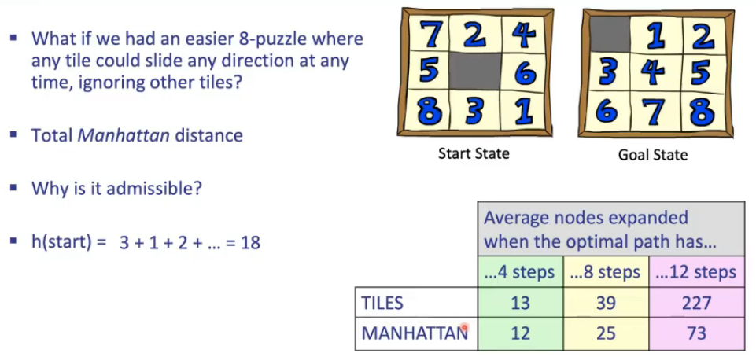

    - ambas heurísticas subestiman, sin embargo la 2 es mejor ya que está más cerca del costo real que h1
- Si se usa como heurística el costo real
  - el número de nodos son exactamente los mínimos
  - Sería admisible
  - Ahorra nodos expandidos
  - Es difícil de calcular

### Heurísticas matemáticamente

- retículo: orden parcial de las cosas

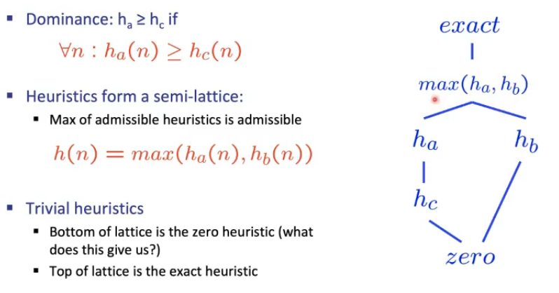

- comparar heurísticas
  - Si para todos los estados ha es siempre mayor que hc, ha > hc
  - ha y hb no son comparables, esto porque puede existir un nodos donde no se cumpla que una siempre es mayor que la otra
- la heurística exacta siempre va a estar por encima de las admisibles
- la heurística que está por debajo de todas es la cero