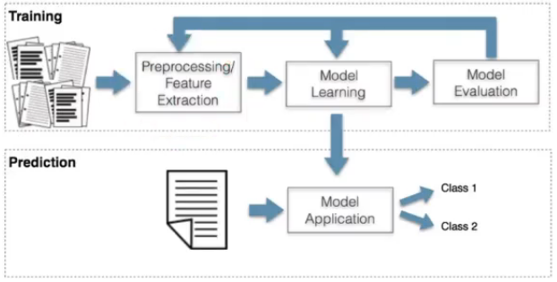

# Clase virtual 2021-03-22

- [video 1](https://drive.google.com/file/d/1eK8pneZVxuMekVCbH3vu5NiKwxoEtisA/view)
- [video 2](https://drive.google.com/file/d/12jIt3OVI8T2F4LXPQXBCaO79u4bew8if/view)

## Astronomía

- planetas - Errantes
  - Vistos a lo largo de los años como;
    - Seres vivos
    - Dioses
    - Influencias astronómicas
  - Comportamiento inusual gracias a la rotación de estos sobre el sol.
- Ptolomeo creía que la tierra estaba en el centro del universo. Detuvo el avance de la astronomía por 1500 años
- Copernico postula el sol como centro. los planetas siguen movimientos circulares.
- Kepler, mal profesor. Se preguntaba por qué la cantidad de planetas y por qué a esa distancia.
  - Propone que la distancia entre los ejes de rotación, están relacionados con los sólido pitagóricos
  - Opinión negativa de Brahe
  - Trabajó sobre las observaciones de Brahe
  - Se va a trabajar con Tycho Brahe, el tomamba mediciones precisas para la época, durante 35 años
  - Las órbitas elípticas describen los movimientos planetarios
  - Leyes:
    1. un planeta describe una órbita elíptica, con el sol en uno de sus focos
      - El planeta recorre en un periodo de tiempo un área en forma de cuña. Las áreas aunque diferentes, tenían la misma área
    2. El vector que une el sol con un planeta, barre áreas iguales en tiempos iguales
    3. Relación entre el tamaño de la órbita y la velocidad media alrededor del sol. Esa relación es la gravedad, descubierta por Newton. Relación entre el eje semi-mayor y el periodo de la órbita

      

  - **Libro:** La armonía de los mundos
- **Machine learning:** Se tienen datos y a partir de estos se induce un modelo que es capas de hacer predicciones o describir el mundo.
  - Se aplica el método científico de forma automática
- **Paradigmas:**
  - **La ciencia experimental:** recoger datos e intentar describir fenómenos naturales
  - **Ciencia teórica:** Surge en el renacimiento. Teorías de los primeros físicos y científicos. Método científico.
  - **Ciencia Computacional:**
    - Modelos y simulación
    - Supercomputadoras
  - **Data-Intensive Science:**
    - Posibilidad de analizar datos y formular teorías

## Machine Learnig

- Área de la inteligencia artificial
- Estudio de sistemas que pueden aprender a partir de datos.
  - Los datos pueden provenir de diferentes fuentes como de la interacción del sistema con el ambiente
- Se buscan patrones que permitan crear modelos descriptivos o predictivos
- Tipos de aprendizaje:
  - **Supervisado:**
    - Encontrar una función que relacionan un conjunto de entradas con un conjunto de salidas
    - Los datos con los que se entrenará el modelo tienen etiquetas, indican el resultado
    - Tamaño de la orbita -> periodo del planeta
    - Problema: Clasificación
    - Cuando la variable de salida es continua: problema de regresión

    

    - Cuando la variable de salida es discreta: problema de clasificación

    

    - Entrada: n pixeles con valores de gris entre 0 y 255
    - Salida: valor discreto de dígitos
  - **NO Supervisado:**
    - El problema se enfoca en encontrar la estructura subyacente a los datos, que explique la estructura de los datos
    - Ejemplo: Clustering

      

  - **Refuerzo:** El sistema sabe la salida y se ve condicionado por una función que evalúa sus acciones
    - Se aprende una política, es óptima si el valor de recompensa es máxima
- **Aprendizaje de máquina**

  

  - Se tienen los datos de entrada, generalmente no se pueden ingresar en bruto.
  - Proceso de extracción de características: Depende de la naturaleza de los datos
  - Proceso de aprendizaje: el algorítmo induce un modelo
  - Se evalúa el modelo, el proceso es iterativo, se refina el modelo
  - Cuando el modelo es satisfactorio (debe tener un porcentaje de precisión) es desplegado
- **Aprendizaje del modelo:** Cómo inducir modelos a partir de los datos?
  - Se pueden tener múltiples modelos candidatos, pero elegirlos depende de lo que se perciba como correcto

    

   - En la imagen hay múltiples modelos candidatos, cada uno tiene diferentes grados de precisión
   - Se debe tener un criterio para elegir el modelo
   - El problema de aprendizaje del modelo está **mal condicionado**

    | i | 0 | 1 | 2 | 3 | 4 | 5 |
    | :---: | :---: | :---: | :---: | :---: | :---: | :---: |
    | R | 1 | 2 | 4 | 8 | 16 | ? |
    | R | 1 | 2 | 4 | 8 | 16 | 31 |
    | R | 1 | 2 | 4 | 8 | 16 | 32 |

      $2^i$

   - Si no se tienen suposiciones adicionales que restrinjan las soluciones posibles, es un problema mal condicionado.
   - Hay que condicionar las posibles soluciones.
   - **Espacio de hipótesis:** Conjunto de funciones que se buscan, enlas que se imponen restricciones
   - El problema se puede resolver de forma:
     - Probabilística
     - Geométrica
     - Optimización
- **Principio de parcimonia:** simplicidad
  - Occam: si todas las cosas se mantienen igual y se tienen 2 soluciones que explican los datos, la más sencilla es la mejor, es la que tiene más probabilidad de ser cierta.
- La inteligencia artificial sigue el principio de parcimonia

Parte práctica, video 2, min 30.

