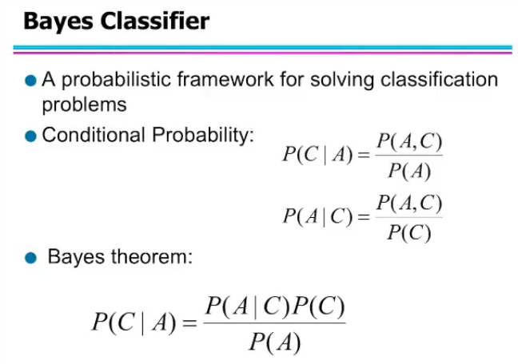
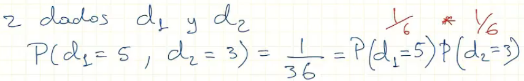
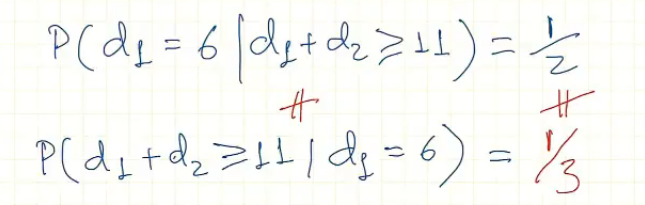
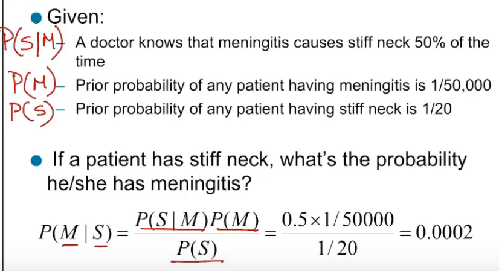
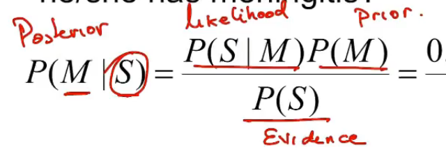
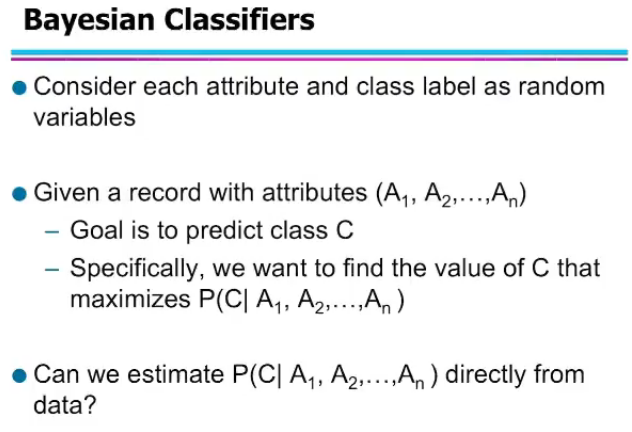
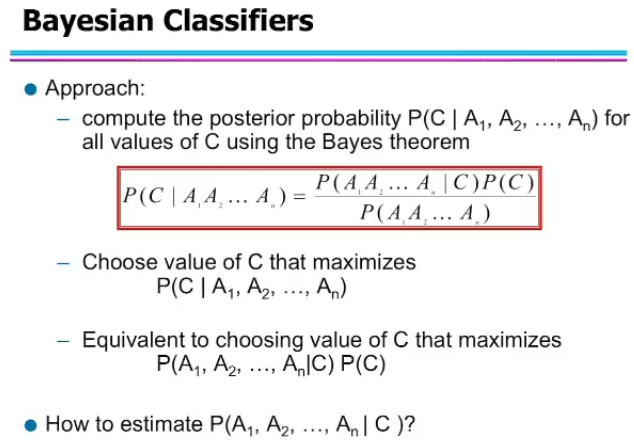
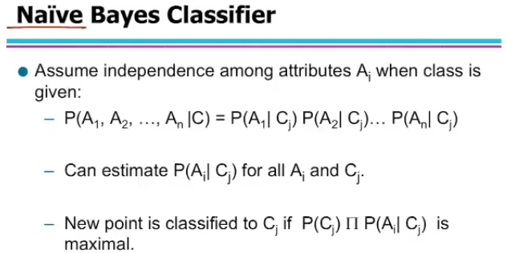
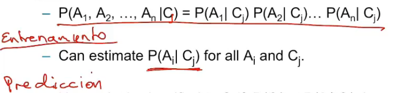

# Clasificador Bayesiano

- viene del matemático Thomas bayes

- **probabilidad conjunta:** Probabilidad de dos eventos separados = producto de la probabilidad de los eventos independientes

  

- **Probabilidad condicional:** La probabilidad condicionada de C dado A, es igual a la probabilidad conjunta de A y C, dividido por la probabilidad de A.
  - En la probabilidad condicional no se pueden invertir los terminos y esperar que el resultado sea el mismo.

    

- **Teorema de Bayes:** Relaciona las probabilidades de C dado A, en terminos de la probabilidad de A dado C y de la probabilidad de los eventos A y C

    

- En el ejemplo se busca cuál es laprobabilidad de que se tenga meningitis dado los datos de tortículis.
- Nombres de las probabilidades:
  - **Posterior:** probabilidad resultante luego de tener información adicional
  - **Prior:** Información base, de un evento independiente sin datos adicionales
  - **Evidence:**
  - **Likelihood:**

    

- **Clasificador:**
  - Se concidera cada atributo y la etiqueta de clase como variable aleatoria.
  - $A_i$ Atributos o variables de entrada
  - Ver la probabilidad de que la clase C sea positiva o negativa dados los eventos $A_i$
  - se clasifica en la Clase con la probabilidad más alta.

    

  - Para obtener esa probabilidad se usa el teorema de bayes

    

  - Por qué se olvida del denomidador? - porque es **constante**
  - Cómo se estima el numerador?
    - Se peude hacer contando las posibilidades
    - Si $A_i$ fueran binarias, cuántas configuraciones habrían? = $2^n$ donde n es al cantidad total de atributos A.
    - Hacer ese calculo puede ser muy tedioso
- **Bayesiano ingenuo - Naïve Bayes**
  - Se factoriza la probabilidad de C dado todos los eventos, como el producto de la probabilidad de C de cada uno de los eventos $A_i$

    

  - Se asumen los aributos como independientes, aunque esto generalmente no pasa.
  - Son condicionalmente independientes dado C
  - Entrenamiento y predicción

    

    min 50
