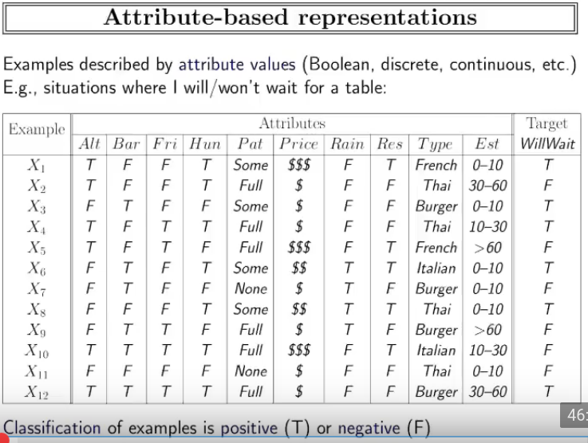
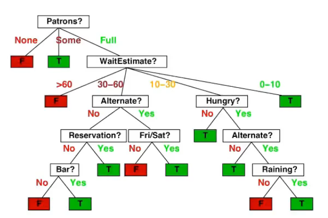
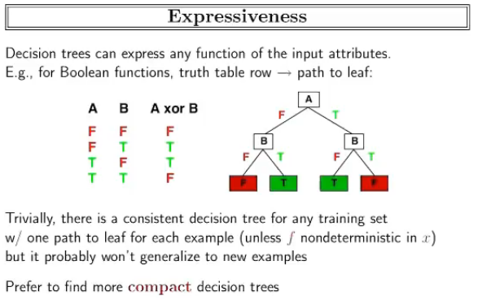
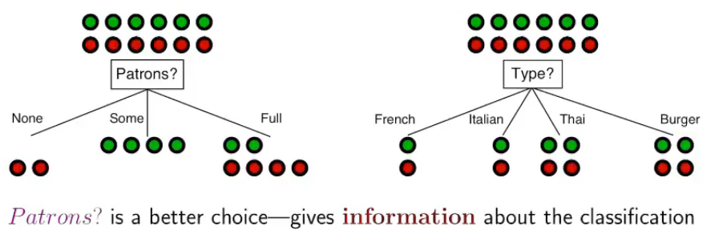

# Árboles de decisión

- Ejemplo:

  

  - Agente que tome la decisión
  - Posibles escenarios:
    - Variables binarias: $2^6$
    - Otras :v  $3^2 \cdot 4^2$
    - Total = $2^6 + 3^2 \cdot 4^2 \approx 9\cdot 10^3$
- **Árbol de desición:**

  

  - **Nodos hojas:** valores para el atributo de salida -> decisiones
  - **Nodos internos:** atributos
  - Se toma un escenario
- ¿Qué tan representativo es?

  

  - puede representar cualquier función discreta o boolena
  - Es costoso, crece exponencialmente
  - Podemos ver las decisiones que se están tomando y entender qué está haciendo.
  - En el primer nivel se pone una variable y cada rama es una alternativa, en la siguiente capa
  - Cada nodo hoja representa un posible resultado
  - Se busca un árbol compacto que otorgue información
- ¿Cómo contruirlo?
  - Con algún criterio se escoge el atributo raíz de las columnas o variables.
  - Se van agrupando los datos según los diferentes valores del criterio seleccionado.
    - Si la variable objetivo tiene un único valor para el conjunto formado, se genera una hoja
    - Si no hay un resultado común para el subconjunto de datos, se utiliza otro criterio y se repite el procedimiento.
- ¿cómo elegir atributos?

  

  - quedarse con el atributo que de más información
  - elegir el atributo que clasifique los datos en grupos y no mesclados
  - Relación entre entropía e información:
    - la entropía y la información son medibles en Teoría de la información
    - La entropía es información negativa.
    - Cuando la información crece, la entropía decrece.
    - ¿Cómo se mide? -> bit (medida de información)
      - bit: información de una pregunta binaria

41 min