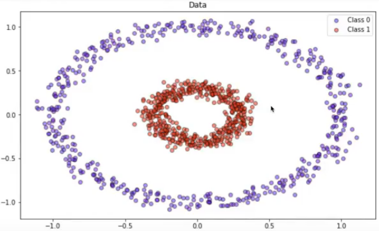
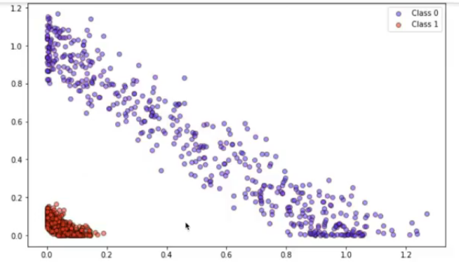
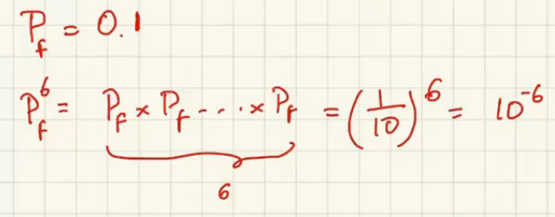
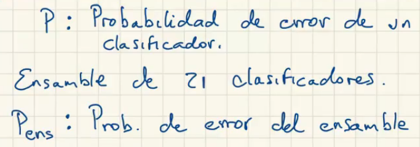
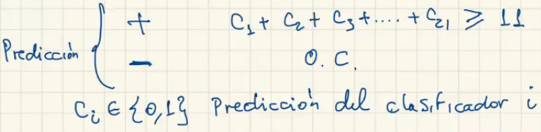
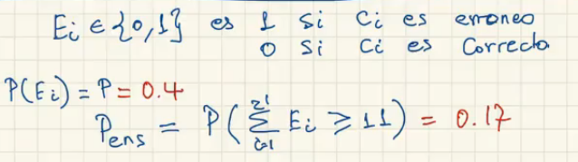

# Support-vector machines, random forest

- [Video 1](https://drive.google.com/file/d/1J-oOjZfh0oTWPPrwHoE5VA8irGQ41n81/view?usp=sharing)
- [Video 2](https://drive.google.com/file/d/1rgXm_XtV8NHi0W3UlpSbkQOgTWdIzvgy/view?usp=sharing)

## Métodos de Kernel

- ¿Cómo se seleccionan modelos?

  

  - Se puede usar una función lineal realizando una transformación. Suma de cuadrados de las coordenadas.

  

- Hay 2 componentes
  - Espacio de entrada
  - Espacio de características
- El espacio no lineal se transforma en lineal.
- Para enriqueser el espacio se pueden agregarle dimensiones, sin embargo esto puede ser negativo cuando se tienen demasiados datos.
- **Kernel:** Función que calcula el producto punto en el espacio de las características.
  - Producto punto: $x_1*y_1 + x_2*y_2 ...$
  - Controla la geometría del espacio de características
- **Kernel lineal:** El espacio de características y original son iguales.
- **Kernel polinomial:**

  $$
  k(x,y) = (\gamma \langle x, y\rangle + r)^d
  $$

  - $\gamma$ y $r$ son reales positivos
  - $d$ es un entero y describe el grado del polinomio
  - Se mueve al espacio de monomios hasta grado 3
  - Si se aumenta el grado del polinomioo, el modelo se podría sobre-ajustar
- Se trabaja en el espacio inducido por el kernel.
- ¿Cuál kernel es mejor?
  - kush validation (?)
- **Kernel Gaussiano - RBF:**

  $$
  K(x, x') = \exp\left(-\frac{\|x-x'\|^2}{2\sigma^2}\right)
  $$

  - Tiene una fórmula similar a una campana gaussiana
  - Calcula la distancia entre $x$ y $x'$
  - Cuando $\sigma$ es pequeño -> campana ancha. **Subajuste**
  - Cuando $\sigma$ es Grande -> campana pequeño. **Sobreajuste**
  - se debe ajustar
    - $\gamma$ -> del kernel
    - C: parámetro del vector support macchine - **SVC**

## División de los datos

- Se dividen en 3
  - **Entrenamiento:** Entrenar y encontrar parámentros
  - **Validación:** Ayudar para encontrar hiper-parámentros (gamma, coeficiente, grado...)
  - **Prueba:** Se prueba con el modelo ajustado, estima que tan bien se comporta el modelo.
- **Validación cruzada de k pliegues:**
  - Se dividen los datos de entrenamiento-validación en $k$ conjuntos del mismo tamaño
  - se hacen $k$ experimentos donde se va rotando el conjunto de validación entre cada segmento por iteración.
  - Se retorna el promedio
  - Se buscan reducir los sesgos entre los grupos.
    - Puede que los ejemplos sencillos estén en el segmento de entrenamiento y los complejos en la validación, loq ue haría el modelo ineficiente. Esto puede apsar de forma inversa.
    - Los algoritmos son estocásticos, al hacer estos experimentos el error de validación es más robusto.
  - $k$ usualmente es de 5 o 10.
  - Luego de encontrar hiperparámentros, se usa el conjunto de prueba
- **Muestreo estratificado:**
  - Se refiere a que la distribución de clases de cada uno de los pliegues sea igual a la distribución de datos original
  - Los datos se balancean.
- Hallar buen valor para $\gamma$ y $C$
  - Se usa una escala logarítmica.
- **GridSearchCV:** El método para hacer la búsqueda de combinaciones de parámentros. Se le da:
  - Clasificador a usar
  - param_grid: Qué parámentros se van a explorar y los valores de estos.
  - Para cada combinación (144 en el ejemplo) hace 5 folds (pliegues)
  - 144 resultados donde cada uno es el resultado de 5 experimentos.
  - Se busca la combinación con el menor error de prueba.

# Random Forest y Exploración aleatorizada

- Extención de árboles de decisión, se tiene un conjunto de árboles
- Se busca mejorar la capacidad de los árboles de decisión
- Los árboles tienen limitantes para dividir regiones altamente no lineales.

### Baggin classifier

- Entrenar varios modelos sobre el mismo conjunto de datos, pero haciendo que los modelos sean diferentes. Finalmente se usan los modelos para tomar decisiones por comité.
- Se toman diferentes muestras del conjunto de entrenamiento.
  - Muestreo con reemplazo:
    - Se toma un valor del dataset, se crea una "copia", este valor **no** se marca como ya tomado.
    - Pueden existir valores repetidos en un dataset de entrenamiento para cada modelo
    - Pueden existir valores que nunca sean tomados en el entrenamiento de modelos.
    - las muestras son aproximadamente del 66% del conjunto de datos original.
- Para clasificar un dato, se clasifica con cada modelo y por votación se clasifica el dato.
- No necesariamente los sub-modelos tienen que ser de tipo árbol
- Variar profundidad de los árboles y cantidad de árboles creados.
- **Ventajas:**
  - permite contrarrestar el subajuste y sobreajuste
  - crowd wisdom - sabidurái de las masas: Hay estimaciones muy ajustadas o sub-ajustadas. La probabilidad de estar por encima es la misma de estar por debajo, al realizar el promedio, se nivela.
- **Ejemplo:** Sistemas redundates (nave espacial).

  $P_f:$ Probabilidad de error de un sistema

  

- **Ejemplo:** Clasificador

  

  - Para que el clasificador faller, 11 de los sub-modelos se equivoquen

  

  

  - $E_i$ toma valores 1 o 0. La distribución es binomial de Bernoulli. Son eventos independientes
- Los clasificadores deben ser tan independientes como sea posible, aunque esto no va a ser 100% pposible porque todos son entrenados con un mismo conjunto de entrenamiento

## Random Forest

- Cada árbol tiene un subconjunto de características diferentes.
- Se escogen características al azar.
- Es útil con pococs datos
- no es tan sensible a iperparámetros
- no sobreajusta
- se pierde interpretabilidad
- Puede retornar la importancia de las características.

55:00 min