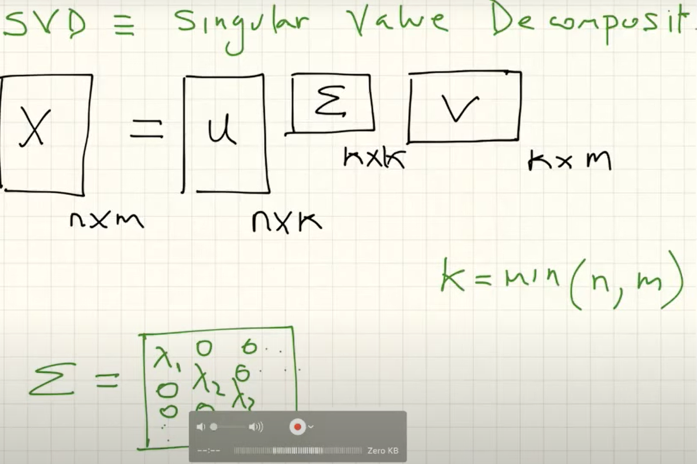
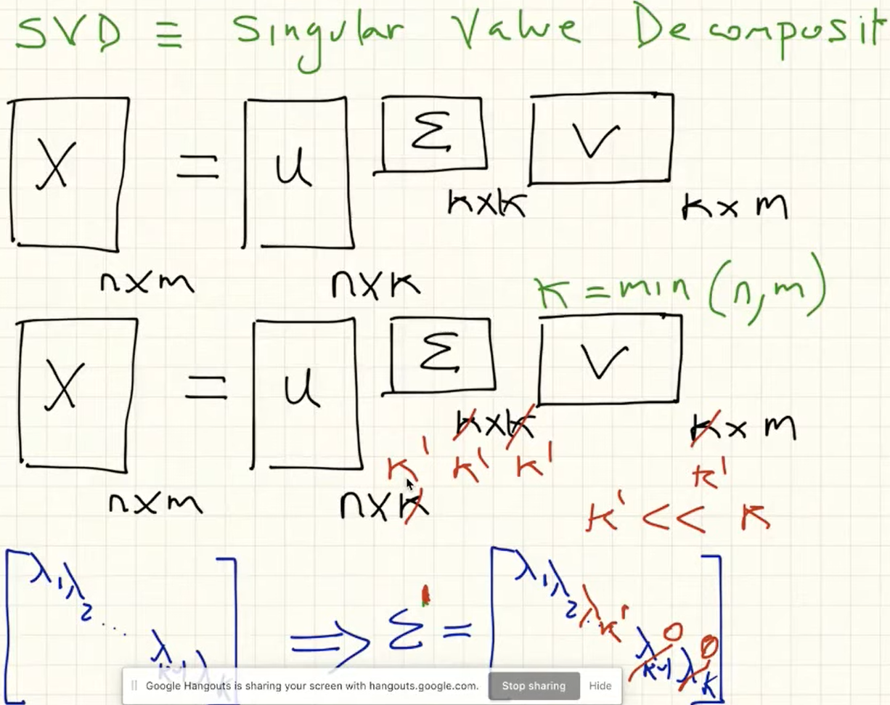
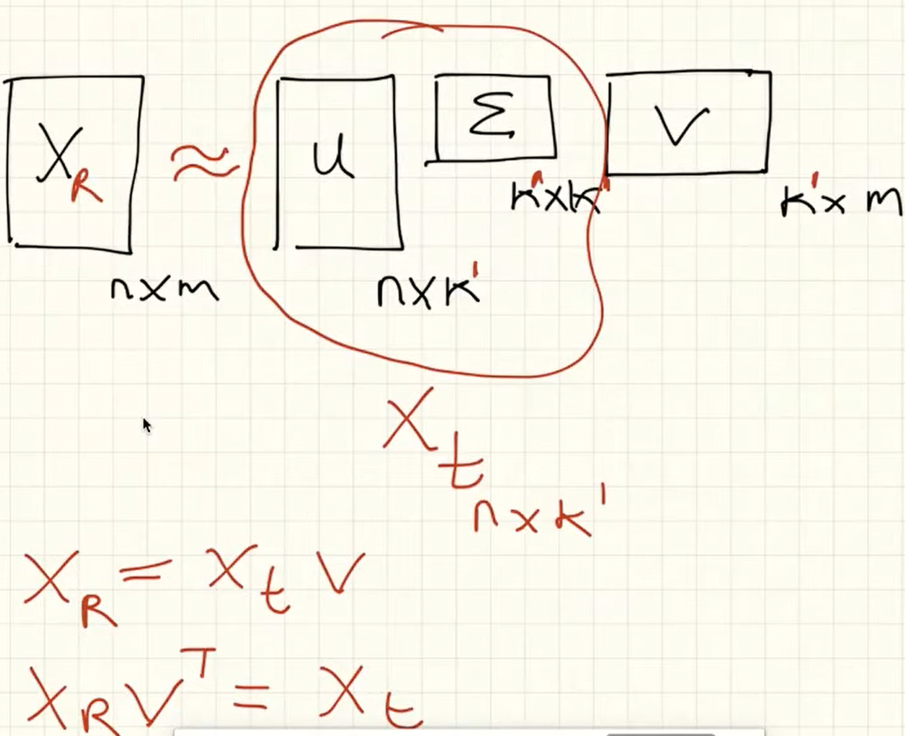
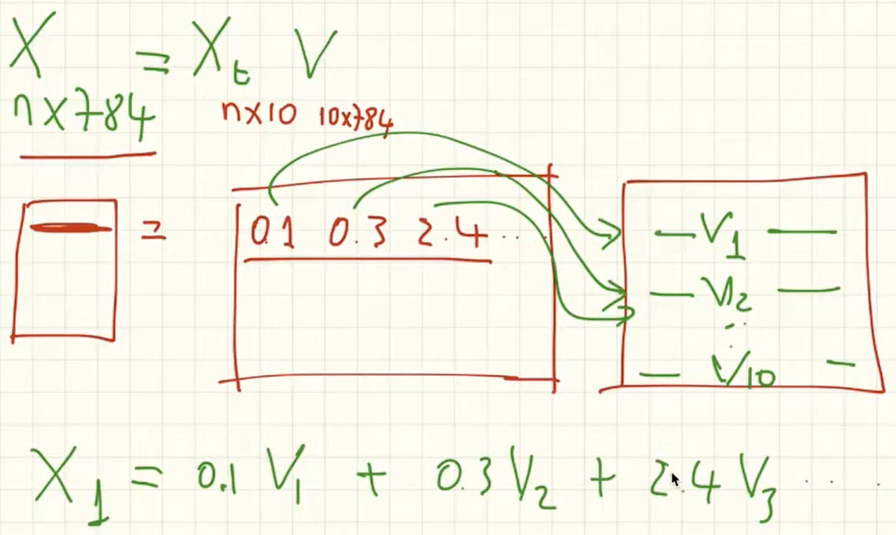

# Reducción de dimensionalidad

[Notebook PCA](https://colab.research.google.com/drive/1UO8TZ4oRsjHhDOaIbU3xM0Ndsf_5QQb8)

- PCA (Anñalisis de componentes principales)
- Se obtiene un nuevo espacio coordenado para representar los datos.
- En caso de 2 dimensiones la direcciòn de mayor varianza es ortogonal a la de menor
- Si hay N dimensiones se obtienen N componentes, sin embargo no es necesario tomar todos los componentes obtenidos
- El modelo ordena los componetes de mayor a menor **varianza**.
- Los componentes deben estar relacionados linealmente.

- `PCA(n_components=None)` use tantos componentes como sea posible

## Ventajas

- Menos espacio para representar los datos.