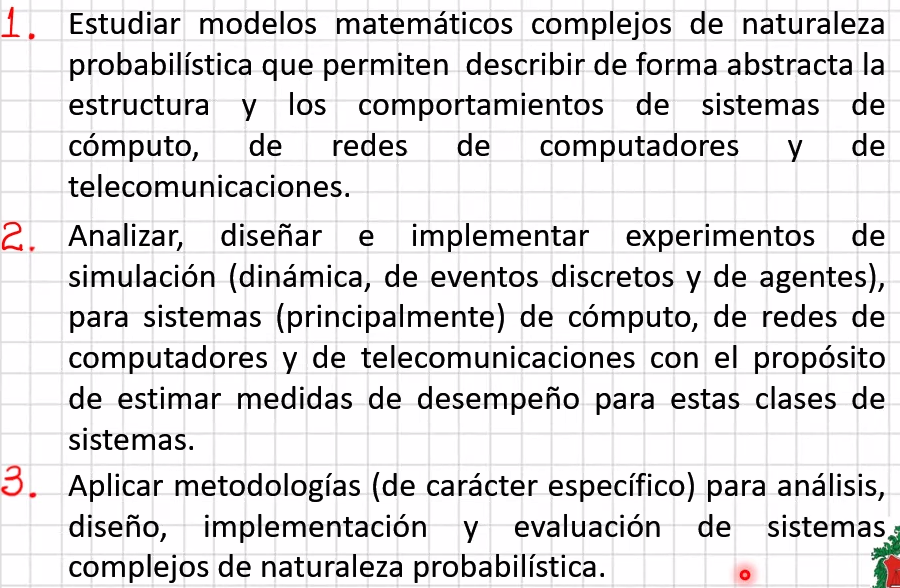
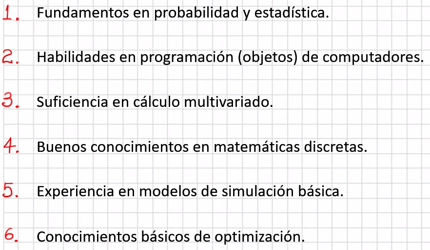

# Clase 2021-03-01

*Hay quien cruza el bosque y no ve leña para el fuego.* León Tolstoi

## Material extra

- [El secreto consiste en saber que libros se deben leer... Carl Sagan.](https://www.youtube.com/watch?v=MwM-odsJ-18)

- **I - Espacio Tiempo:**
  - Las dimendiones usualmente usadas son 4
  - Dentro del espacio
- **II - Estado (sistema):**
  - $X_i$ Variables de estado, en sí mismas aleatorias. En sistemas complejos estas variables son **dependientes**. 
  - $X$ es un vector aleatorio.
  - Estructura de la función probabilística - Estocástica
- **III - Comportamiento:** comportamiento del sistema dentro de ese espacio tiempo
  - $Y_k$ depende del punto en el espacio y del estado del sistema.
  - $Y$ es un vector aleatorio.
  - La función $f_x^{(t)}(x)$ Es dificil que su transformación sean de la misma estructura probabilística, al pasar a su versión en la sección de Comportamiento $f_y(y)$
- **IV - Leyes científicas:** Leyes que rigen el mundo de ese sistema en ese espacio

## Tareas Obligatorias

