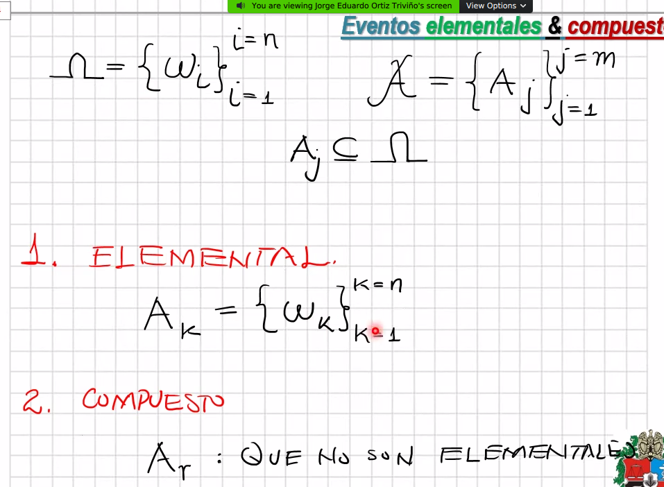
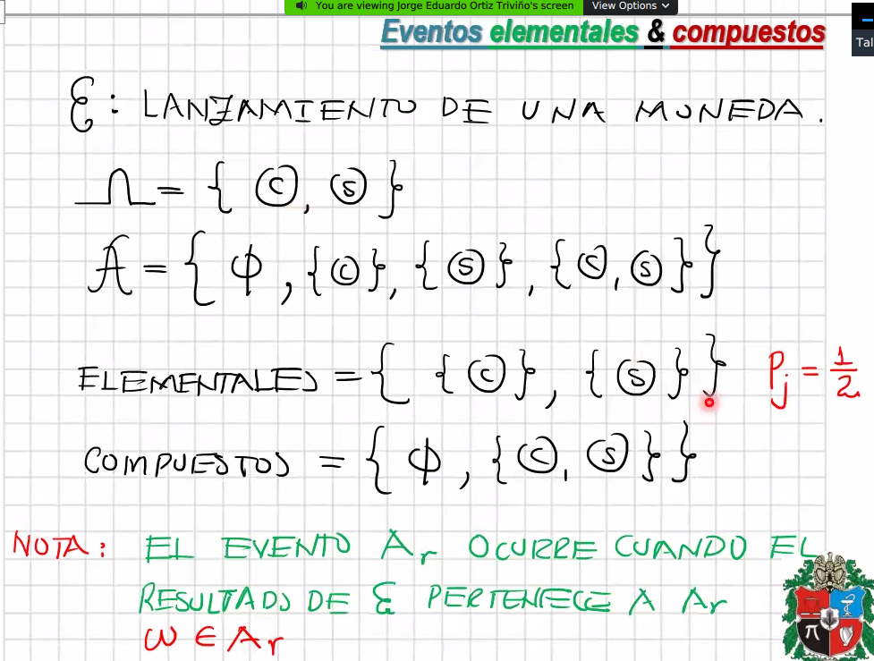

# Espacios de probabilidad y vectores aleatorios

Temas del capítulo:

1. Espacio muestral, de eventos y función de probabilidad -> Espacio de probabilidad
2. Vector Aleatorio
3. Densidades y distribuciones conjuntas
4. Marginales y condicionales
5. Esperanza matemática y funciones generales de movimiento
6. Transformaciones
7. Vector Aleatorio Normal

## Espacio muestral, de eventos y función de probabilidad -> Espacio de probabilidad

- **Experimento aleatorio:**

  

  - hay sistemas complejos que son escencialmente probabilísticos
  - Al ejecutar ese experimento aleatorio, se obtiene un espacio de probabilidad
  - Como por ejemplo el lanzamiento de una moneda
- El **espacio de probabilidad** es un objeto, cuyos elementos son

  

  - $\Omega$ - Espacio muestral:
    - posibles resultados del experimento aleatorio.
    - Usualmente son Naturales pero no siempre.
    - Cada resultado se puede expresar como una tupla de $n_i$ elementos
    - Los resultados del experimentos pueden ser contables y no contables, por ello se usa la letra $I$ para representar los múltiples conjuntos
    - Si se representa un espacio Real, con números naturales, matemáticamente, no existirían los suficientes índices para contar los elementos

    

    - **Ejemplos de experimento aleatorio:**

      

      

      - El espacio muestral es de tamaño infinito ya que pueden lanzar el dado $n$ veces sin obtener el resultado esperado.
      - El tamaño de las tuplas de cada índice se incrementa y puede ser descrito con el conjutno Natural

  - A - Espacio de eventos
    - $A \subseteq \Omega$ A es un evento
    - $A$ es una $\sigma - algebra$ porque cumple esas propiedades
    - A gótica, representa el conjunto de posibles eventos de un experimento aleatorio.
    - Un evento es un subconjunto del espacio muestral

    

    - Explicación de propiedades
      - El conjunto total omega es un evento
      - Si $A$ pertenece al algebra de eventos, su complemento también
      - Si se tienen 2 eventos que pertenecen al álgebra de eventos, su unión también

    

  - P - Función de probabilidad

    

    - Tiene como conjutno de partida el **Espacio de eventos** y lo transforma al intervalo [0, 1]
    - La función se acepta como función de probabilidad si cumple las siguientes propiedades
      - La propiedad de cualquier evento debe ser mayor o igual que cero
      - la probabilidad del espacio muestral es 1
      - Si se tienen n eventos **disyuntos** (no tienen elementos en común), entonces la probabilidad de los eventos $A_i$ es igual a la suma de la probabilidad de cada uno de los elementos.

    

    - Las funciones de probabilidad más usadas, están relacionadas con las medidas de los conjuntos empleados
    - Se considera la dimensión de las tuplas del espacio muestral como las dimensión que se usará para medirlas
    - B es un evento ya que hace parte de omega.
    - B es un evento, pero su área es 0 al ser una línea, la probabilidad de B es cero
    - **Probabilidad:** No es probable que B ocurra
    - **Posibilidad:** Es posible que B ocurra

- **Eventos Elementales y Compuestos**

  

  - El conjunto de eventos elemental $A_k$ es igual al conjunto de eventos constituidos por todos los diferentes subconjuntos de omega
  - Los sobrantes forman el conjunto de no elementales

  

  - usualmente la probabilidad de los elementos del conjutno de *elementales* se **suponen** equiprobables
  - Hay sistemas en los que no es equiprobables, en donde los eventos pueden depender unos de otros.
  - En general, en los sistemas complejos, la probabilidad de los eventos no es equiprobable.

  - Ejemplo: cuando los eventos **no** son equiprobables

    

    - El $k$ es menor o igual a $n$.