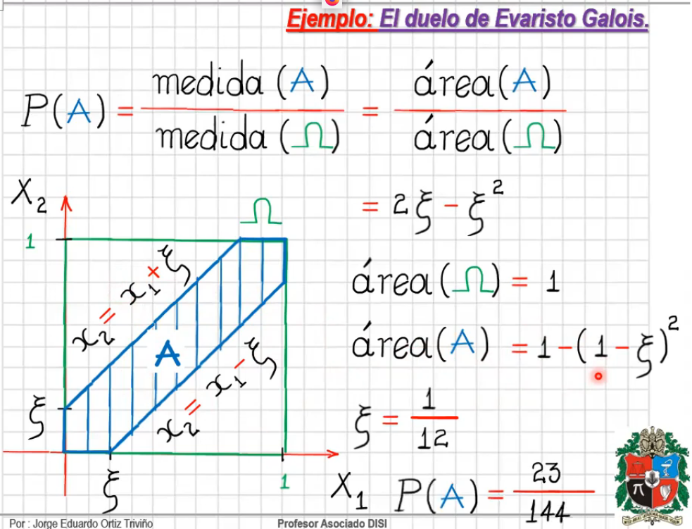
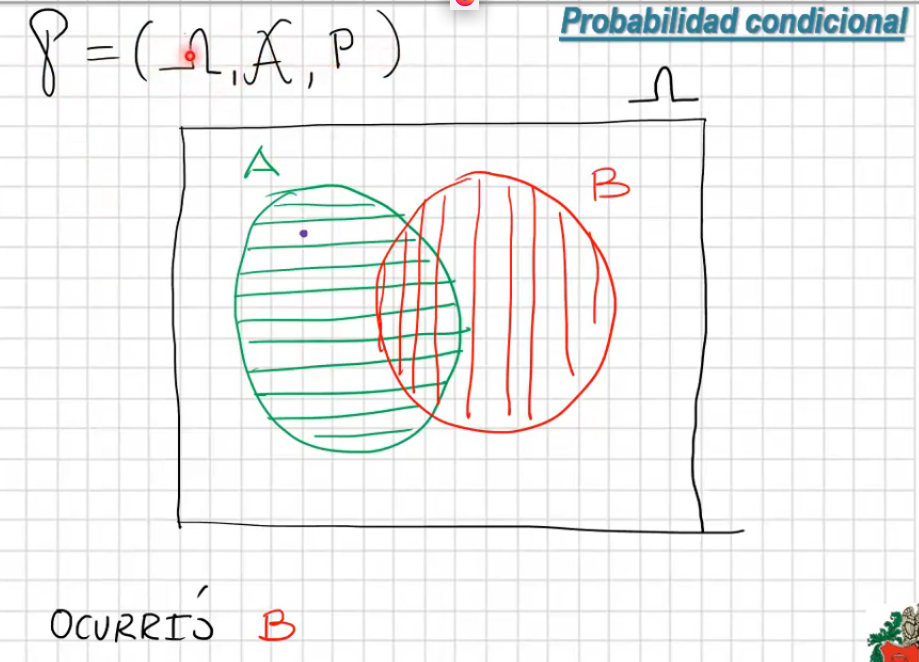
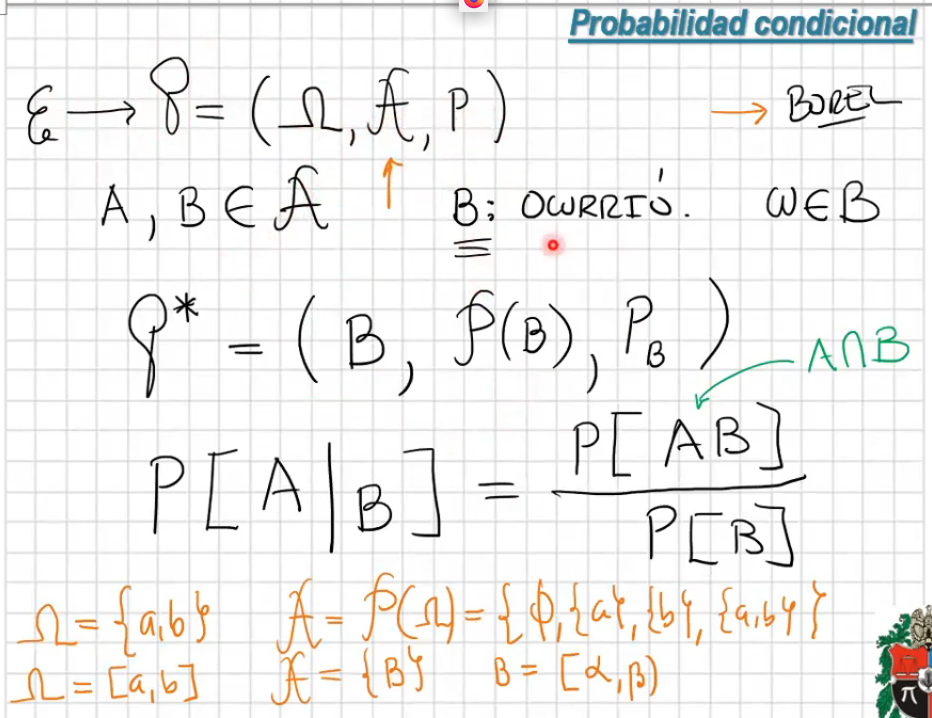
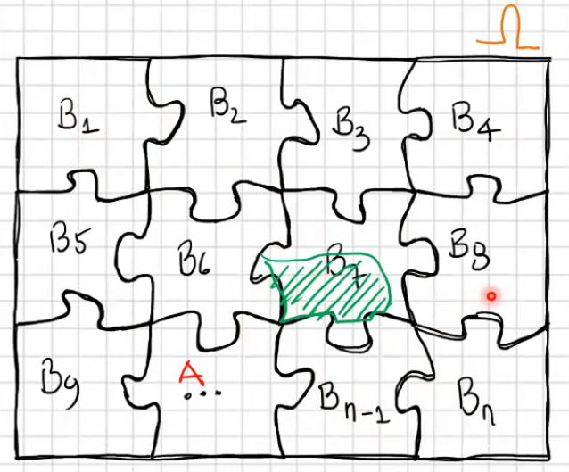

# Espacios de probabilidad y vectores aleatorios

Temas del capítulo:

1. Espacio muestral, de eventos y función de probabilidad -> Espacio de probabilidad
2. Vector Aleatorio
3. Densidades y distribuciones conjuntas
4. Marginales y condicionales
5. Esperanza matemática y funciones generales de movimiento
6. Transformaciones
7. Vector Aleatorio Normal

## Espacio muestral, de eventos y función de probabilidad -> Espacio de probabilidad

Continuación del tema visto el día [2021-03-03](2021_03_03.md)

- **Eventos Elementales y Compuestos**

  

  - El conjunto de eventos elemental $A_k$ es igual al conjunto de eventos constituidos por todos los diferentes subconjuntos de omega
  - Los sobrantes forman el conjunto de no elementales

  

  - usualmente la probabilidad de los elementos del conjutno de *elementales* se **suponen** equiprobables
  - Hay sistemas en los que no es equiprobables, en donde los eventos pueden depender unos de otros.
  - En general, en los sistemas complejos, la probabilidad de los eventos no es equiprobable.

  - Ejemplo: cuando los eventos **no** son equiprobables

    

    El $k$ es menor o igual a $n$. Para resolver el problema hay que tener en cuenta las ecuaciones de las series:

    

    

    

  - Ejemplo: El duelo de Evaristo Galois

    

    

    - Si un duelista llega a las 5am -> $x_1 = 0$
    - Si un duelista llega a las 6am -> $x_1 = 0$
    - $x_1 = \frac{1}{6}$ -> 5:10am
    - El duelista espera 5 minutos, es decir $\frac{1}{12}$

    

    - La suma de la probabilidad de infinitos puntos es cero, ya que la probabilidad -> área de un punto es cero. Similar con lineas

    }

- **Espacios de probabilidad condicional:**

  

  Como ocurrió B, el espacio muestral cambia y se convierte en B

  

  - El espacio de eventos, se reduce al conjunto de partes de B y la función de probabilidad se redefine
  - Eventos continuos: Para la representación de estos se usan los eventos de Borel

  

  Una partición debe cumplir con:
  - La unión de todos los sub-conjuntos equivalen al universo
  - Son elementos disyuntos

  

## Vector Aleatorio
## Densidades y distribuciones conjuntas
## Marginales y condicionales
## Esperanza matemática y funciones generales de movimiento
## Transformaciones
## Vector Aleatorio Normal