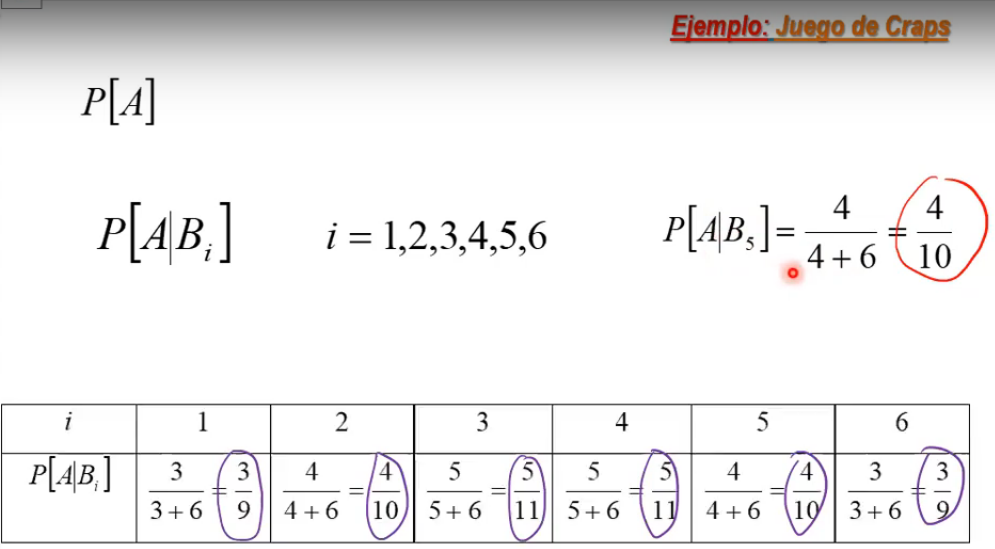

# Espacios de probabilidad y vectores aleatorios

Temas del capítulo:

1. Espacio muestral, de eventos y función de probabilidad -> Espacio de probabilidad
2. Vector Aleatorio
3. Densidades y distribuciones conjuntas
4. Marginales y condicionales
5. Esperanza matemática y funciones generales de movimiento
6. Transformaciones
7. Vector Aleatorio Normal

## Espacio muestral, de eventos y función de probabilidad -> Espacio de probabilidad

Continuación del tema visto el día [2021-03-08](2021_03_08.md)

- **Espacios de probabilidad condicional:**

  

  Como ocurrió B, el espacio muestral cambia y se convierte en B.

  

  - El espacio de eventos, se reduce al conjunto de partes de B y la función de probabilidad se redefine. las probabilidades P[AB] y P[B] son las probabilidades del espacio orifginal.
  - Eventos continuos: Para la representación de estos se usan los eventos de Borel

  

  Una partición debe cumplir con:
  - La unión de todos los sub-conjuntos equivalen al universo
  - Son elementos disyuntos

  

  - Probabilidad de A: Suma de la probabilidad de las intersecciones de A con los $B_i$

  

  - Hay $A_n$ eventos, donde la probabilidad de sus intersecciones de los primeros n-1 es mayor a cero.
  - Entonces la probabilidad de que las intersecciones de los n eventos
  - Base del teorema fundamental de la simulación.

  

  - Hay 2 formas de representar la probabilidad cuando n=2. 
  - Hay reelevancia hacer cambios en el camino de cálculo
    - Sí, hay caminos más eficientes
  - Hay algoritmo que permita conociendo el n, saber qué ruta seguir y que sea óptima? NO

  

  Ayuda para tarea

  

  - comprender el mundo, teneindo información adicional. Cómo el agente aprende a travez de ello.
  - Procesos de negociacion
  - La probabilidad $B_k$ dado que se conoce la ocurrencia del evento $A$...

  - **Ejemplo:** Juego de Craps

    

    - Dos dados, los lanzan y se miran las caras de los dados y sus sumas
    - El primer lanzamiento:
      - Gana si se obtiene un total de 7 u 11
      - Pierde si se obtiene un total de 2, 3 o 12
    - Si no gana ni pierde, el total obtenido es el *punto*
    - Se lanza hasta que se obtenga 7 o su punto
    - Se gana si se obtiene el *punto*
    - Pierde si obtiene 7
    - ¿Cuál es la probabilidad de ganar el juego?

    

    - A y C son disjuntos

    

    

    - La probabilidad de que la suma de 5 es de 4/36, ya que de 36 casillas solo 4 cumplen la condición.
    - La probabilidad de ganar luego del primer lanzamiento, teniendo como punto a $B_6 = 10$ es $\franc{3}{3+6}$ ya que hay 6 eventos donde puede obtener 7 y perder, mas 3 eventos donde puede obtener 10 y ganar

    

    Probabilidad de ganar o perder en el **primer** lanzamiento

    

    

    - La probabilidad de ganar luego del primer intento, teniendo como *punto* el $B_5=9$, es de 4/10

    

    - Por el teorema de la probabilidad total, la probabilidad de ganar luego del primer lanzamiento es de 0.27

50 min