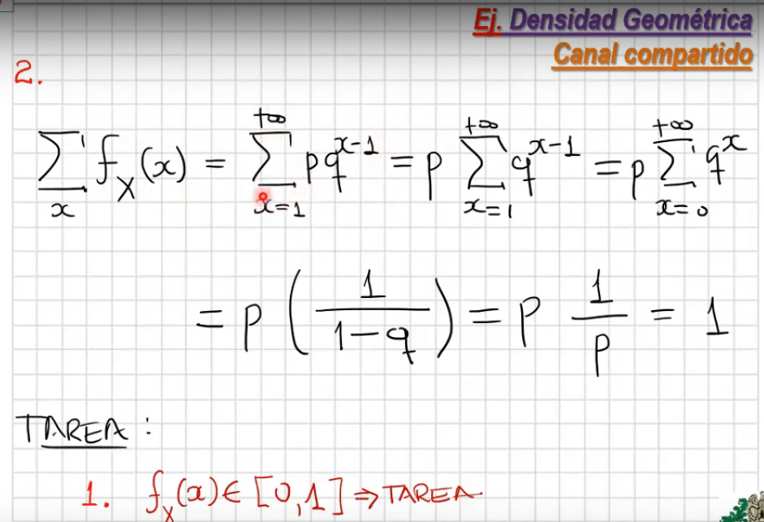

# Calendario actualizado

- Inicio de exposiciones: 07 de abril de 2021

# Espacios de probabilidad y vectores aleatorios

Temas del capítulo:

1. Espacio muestral, de eventos y función de probabilidad -> Espacio de probabilidad
2. Vector Aleatorio
3. Densidades y distribuciones conjuntas
4. Marginales y condicionales
5. Esperanza matemática y funciones generales de movimiento
6. Transformaciones
7. Vector Aleatorio Normal

## Variables y vectores aleatorios

### Densidades, distribuciones

- **Función indicadora:**

  

  - A es el evento
  - w es el resultado del experimento aleatorio
    - si w es 0, el evento A **no** ocurrió.
    - si w es 1, el evento A **sí** ocurrió.

  

- **Variable aleatoria:**

  

  - El espacio muestral $\Omega$ tiene elementos que no necesariamente son números, son objetos resultados del experimento aleatorio.
  - $X$ es la variable aleatoria que va del espacio muestral a los reales

  

  - Son un conjunto grande de variables aleatorias
  - La variable aleatoria exponencial, es importante en el modelamiento de teletráfico -> mundo contínuo
  - La familia paramétrica geométrica -> mundo discreto
  - La forma para representar la estructúra probabilística de las variables es por medio de 3 tipos de funciones:
    - Densidad de probabilidad $f_X(x)$
    - Distribución de probabilidad $F_x(x)$
    - Percentiles de probabilidad
      - Se emplean en estudios de simulación
      - Se usan en inferencia, con grandes volúmenes de datos
  - Los modelos a veces no trabajan directamente con las funciones si no que se basan en las propiedades de las variables aleatorias
    - Media
    - Varianza
    - Momentos
    - Informació

  - **Familias Discretas - Densisdad discreta:**

    

    - Probabilidad de que $X=x$
    - Ejemplo se selecciona persona
      - Probabilidad de que la edad sea 21
      - $X$ es la Edad
      - $x$ es 21 - la edad de la persona elegida
    - En el caso discreto, no cualquier función puede ser conciderada fucnión de densidad. Debe cumplir las 2 propiedades:
      - debe tener valores entre 0 y 1
      - la suma de todas las probabilidades es 1
    - Ejemplo **Densidad discreta**

      

      

      

      

      Se demuestra que la suma de todas las probabilidades de los eventos posibles es 1.
  - **Densidad continua:**

    

    - La función no está en el intervalo [0, 1]
    - La función no es directamente probabilidad
    - **Ejemplo** función exponencial

      