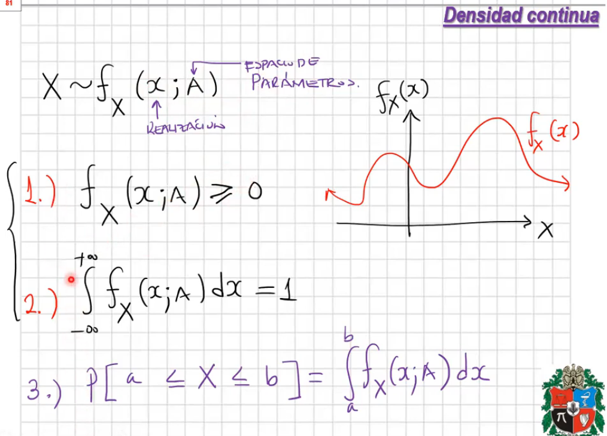

# Espacios de probabilidad y vectores aleatorios

Temas del capítulo:

1. Espacio muestral, de eventos y función de probabilidad -> Espacio de probabilidad
2. Vector Aleatorio
3. Densidades y distribuciones conjuntas
4. Marginales y condicionales
5. Esperanza matemática y funciones generales de movimiento
6. Transformaciones
7. Vector Aleatorio Normal

## Variables y vectores aleatorios

### Densidades, distribuciones

  - **Densidad continua:**

    

    - La función no está en el intervalo [0, 1]
    - La función no es directamente probabilidad
    - **Ejemplo** función exponencial

      

      

      Demostración de propiedades

      

    - **Ejemplo 2:**

      

      

  - **Función de Distribución:**

    

    - Desde el punto de vista formal, los números aleatorios están entre [0, 1]
    - El númeor aleatorio representa una probabilidad.
    - En otro caso decir que es una realización de la variable aleatoria
    - Es una función **no** decreciente.
    - La función es contínua a derecha

    

    - 1: es creciente pero supera el 1, no es probabilidad
    - 2: no es contínua a  derecha, lo es a izquierda
    - 3: cumple las propiedades, es no decreciente, se mantiene en [0,1], es contínua a derecha. Típica en variables aleatorias discretas.
    - 4: típica en variables contínuas
    - 5: es una función de distribución bien definida.

    

    - **Ejemplos:**

      

      

      

  - **Propiedad de pérdida de la memoria** Une al modelo geométrico y exponencial
    - Relaciones:
      - geométrico -> discreto
      - exponencial -> contínuo
    - Un usuario ha esperado transporte durante 3 minutos y en promedio el bus pasa cada 5 minutos, cuántos mínutos debe esperar? El modelo es exponencial
      - Debe esperar 5 minutos porque al modelo se le olvida que el usuario está experando.

    

    
