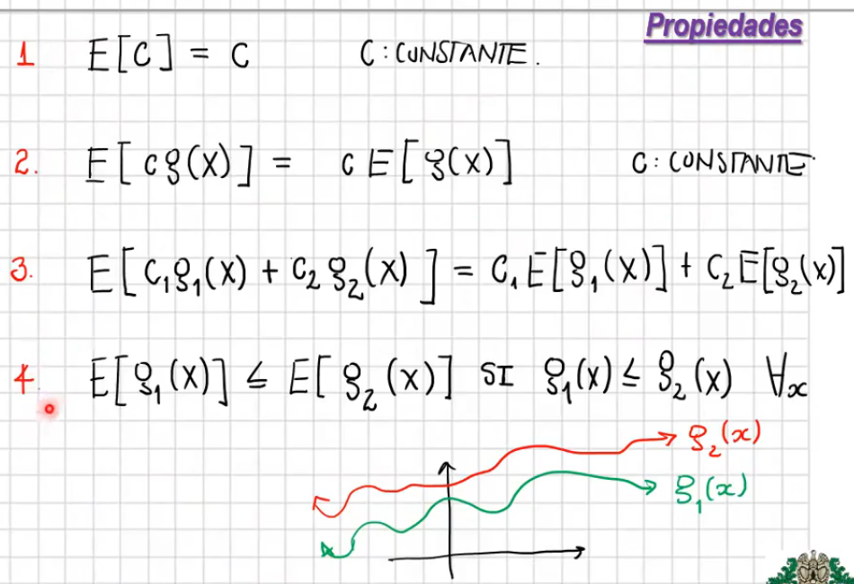
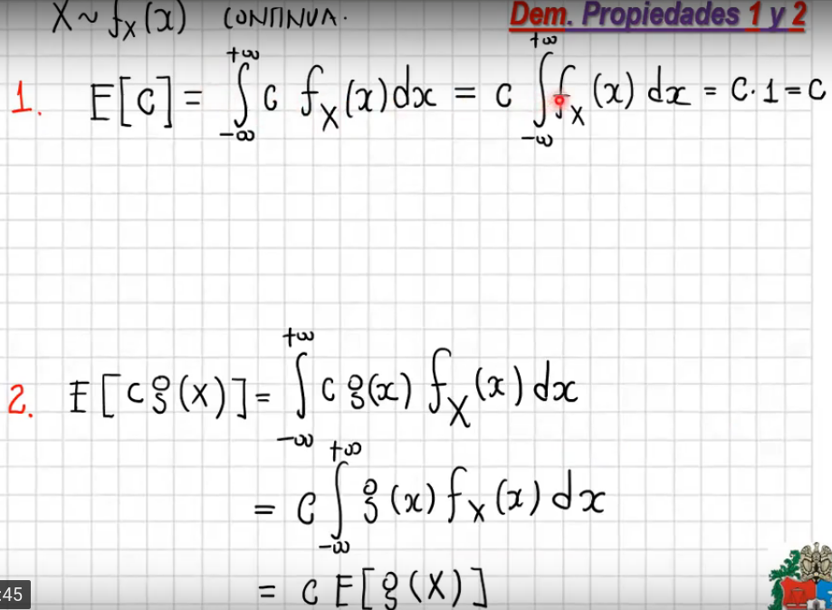
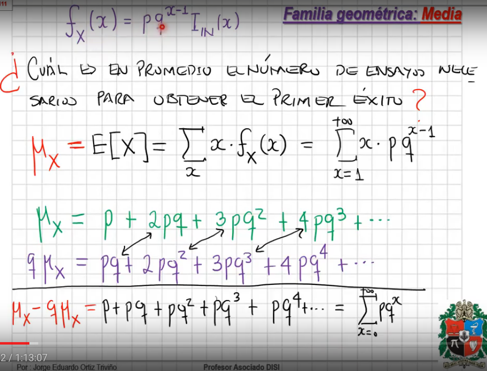
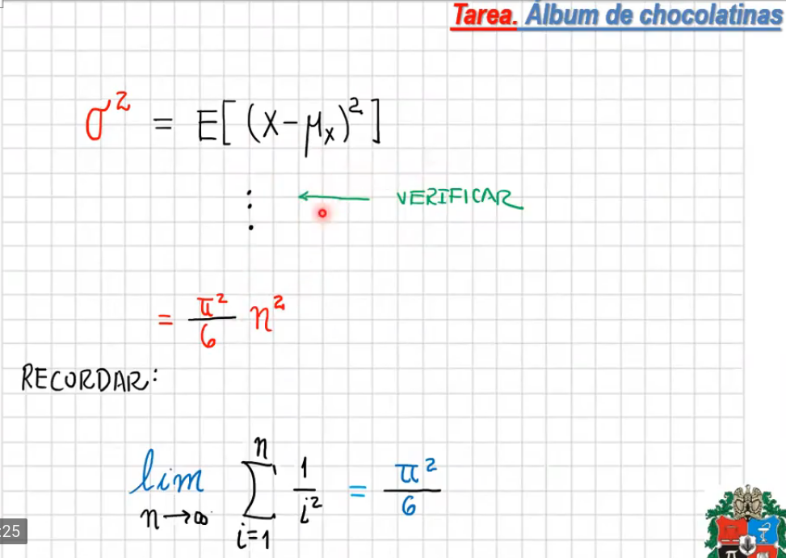

## Esperanza matemática y Momentos

- [Video](https://drive.google.com/file/d/1Pj9iGxjO8X09w5qIT2FceL0Z1H26jfIf/view)

- n funciones $g_i$
- $g_i$ toma la realización de una variable aleatoria y la transforma.
- La esperanza matemática de $g_i(x)$ como la esperanza matemática sobre $X$ (mayúscula)

Demostración de propiedades 1 y 2

### Media

- Exponencial

  

- Geométrica

  

  

### Varianza

- Exponencial

  

- Geométrica

  

### Ejemplo láminas chocolatinas

- EL patrón de cmpras es el de una variable aleatoria geométrica (fracasos hasta el primer éxito)

### Ejemplo red

- Red de computadores estocástica y dinámica:
  - Cada máquina tiene características de comunicación inalámbrica
  - los dispositivos se pueden mover
  - Cada dispositivo puede tomar desiciones (Agente artificial)
- EN el ejemplo hay comunicación de tipo Ad Hoc (No hay nodo central, todos tienen iguldad de condiciones)
- Es dinámico, la infraestructura cambia

- Un objeto computacional (Archivo, imagen...) es dispersado por la red.

  

  

- Para recopilar el objeto selecciona un dispositivo aleatorio y pregunta si tiene una parte del objeto computacional. El no sabe cuál es (similar al ejemplo de la cholocatina)

### Ejemplo Burbuja

