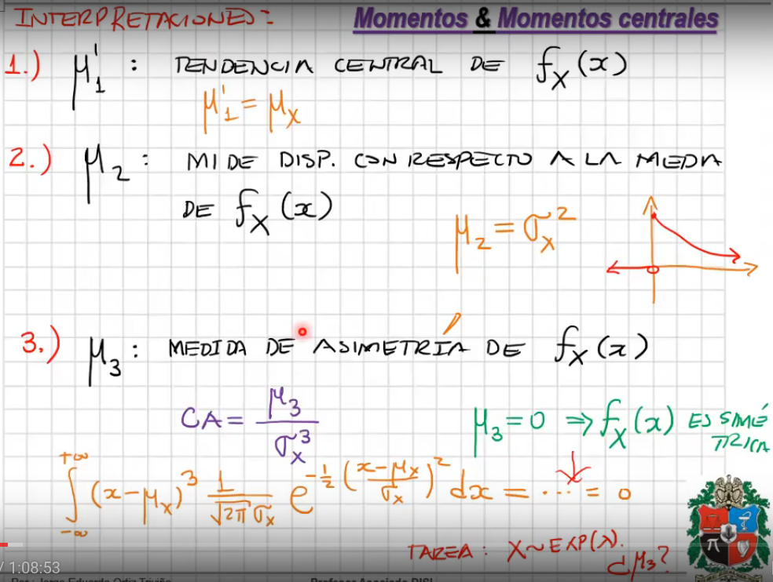
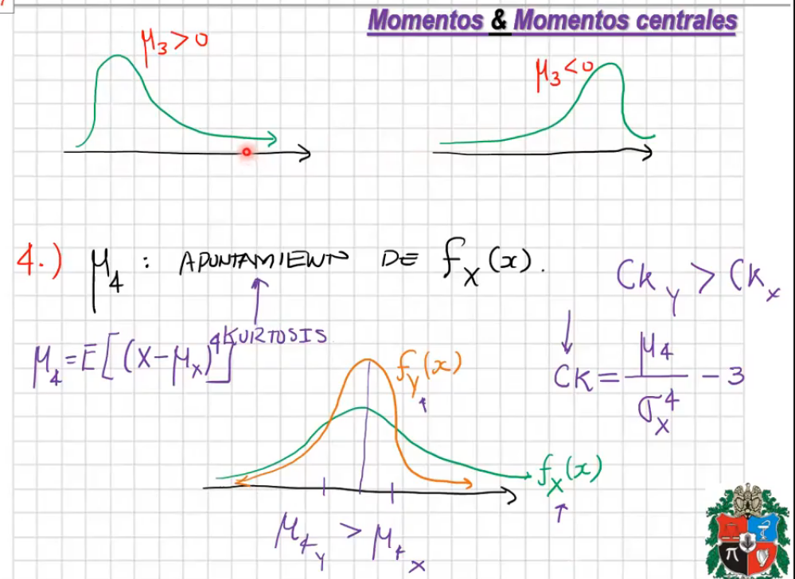
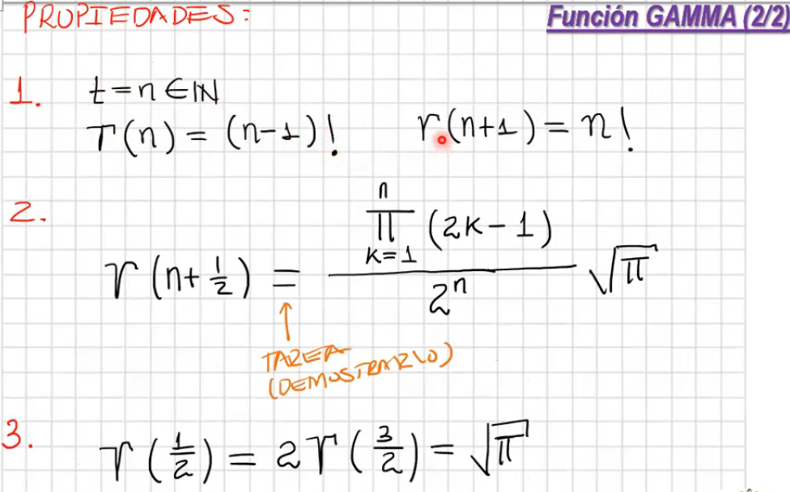

## Momentos y Momentos centrales

- El primer momento central no sirve ya que no da información porque su valor es cero.
- El primer momento es igual a la media de la variable aleatoria

- Una variable aleatoria puede tener infinitos momentos.
- Usualmente se toman los primeros momentos
- **CA:** Coeficiente de asimetría
- **CK:** Coeficiente de kurtosis

- De esta función generadora de momentos se puede deducir:
  - La media es 4
  - La varianza es 16
- Generalización de una variable aleatoria exponencial -> La función de dencidad GAMMA
  - La familia GAMMA, esta función gobierna su comportamiento

  

  

  

  

  

  

  

  
