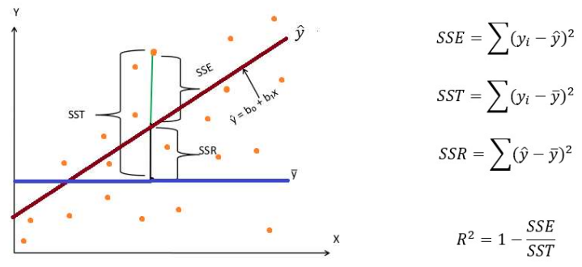

# Validación de Modelos
## Cómo saber si un modelo es bueno?
- **Subajustado:** Da información muy genral de los datos, no tiene en cuenta los patrones de los datos
- **Sobreajustado:** El modelo se aprende de memoria los datos de entrenamiento, al entregarle datos nuevos, el modelo no lo sabrá captar. No generaliza los patrones reales de los datos.

## Cómo mejorarlo? (Predicción)

Busca encontrar una variable continua, por lo tanto el modelo es una ecuación.

- **Línea roja:** Modelo
- **Línea azul:** promedio de la variable objetivo.
- **SSE:** Suma de cuadrados de los residuales. Distancia del dato real al modelo
- **SST:** Suma de cuadrados de tratamiento. Distancia del dato real al valor promedio, varianza.
- **SSR:** Suma de cuadrados debido a la regresión. Error de regresión, proporción de regresion que captura el promedio

## Castigar al Modelo

- **SSE:** Indicador del error de los valores que está prediciendo el modelo
  $$ SSE = \sum (y_i-\hat{y})^2 $$
- **$f(c):$** función de costo: que tan complejo es el modelo. Que tantas variables está tomando el modelo.
- **Ecuación costo final:** Ecuación que se buscará minimizar.
  $$ J = SSE + f(c) $$

### Regularización

- **Lasso:** Bajar coeficientes a cero, eliminar variables. Trata de bajar los coeficientes a cero.
  $$ f(c) = \lambda \sum_{j=1}^k |\beta_j|  $$
- **Ridge (L2):** Disminuir los coeficientes de las variables. Busca tomar los coeficientes y volverlos muy pequeños.
  $$ f(c) = \lambda \sum_{j=1}^k \beta_j^2  $$

$\lambda:$  Factor por el que se castiga la complejidad del modelo.
$\beta_i:$ Coeficiente de la variable i.

## Cómo visualizar si vamos bien

Entrenar varios modelos y graficar la complejidad del mismo con el error de predicción del mismo. Este error puede ser obtenido de los vaores de entrenamiento o de prueba.

## Sobreajuste en clasificación

### Otro tipo de métricas

- **Score:** % total de predicciones correctas
- **Sensibilidad:** Tasa de verdaderos positivos.
- **Precisión:** Valor de predicciones positivas. De todas las veces que se dijo "sí" cuantas fueron ciertas?
- **Especificidad:** De todos los casos negativos, cuántos acerté?

Las metricas a utilizar dependen del caso de uso. Verificar el costo de la métrica, que implicaciones tienen los resultados en la vida real.

## Suficiente en el caso debalanceado?

Para manejar los valores intermedios de probabilidad, se puede jugar con el umbral en el cual el modelo define cuando responder "sí" y cuando "no".

# Notebook
- el modelo que dice que no, realmente no es bueno, el r2 no sirve
- se equivoca en los importantes - caso cancer