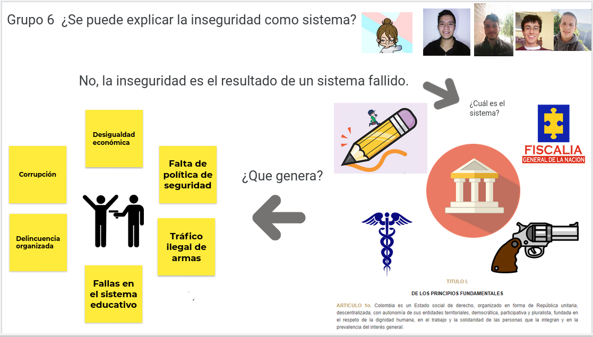

# Actividad 1

- [Jamboard](https://jamboard.google.com/d/1glb6wzJw5niUfkfExuHEZky6OiGb1UYbk46QubsoeoU/viewer?f=0)
- **Página:** 7
- **Fecha de asignación:** [2021-02-23](../../class_notes/2021_02_23.md)
- **Fecha de entrega:** 2021-03-23

## Descripción

Responder a la pregunta *¿Se puede explicar la inseguridad como sistema?* y justificar la respuesta.

## Solución

