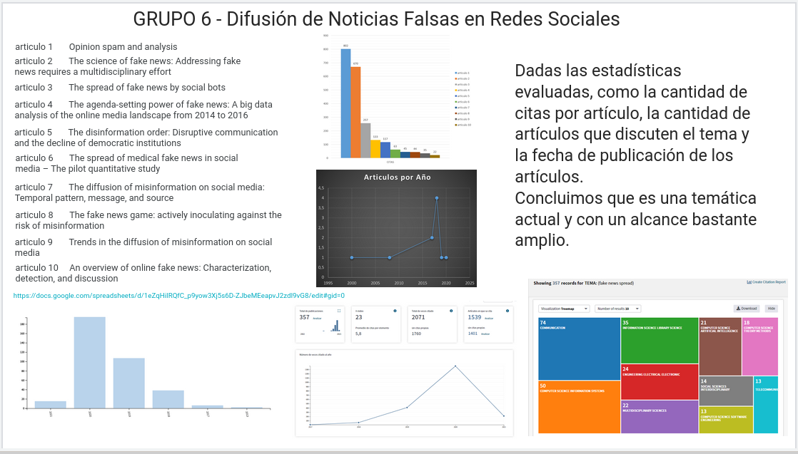

## Actividad 2

- [Jamboard](https://jamboard.google.com/d/1FdgDM_jB8o_nFfgzybEe-cQ5EIUp1-sg2hyddVTVIQs/viewer?ts=6037a5e9&f=5)
- **Página:** 13
- **Grupo:** 6
- **Fecha de asignación:** [2021-02-25](../../class_notes/2021_02_25.md)
- **Fecha de entrega:** 2021-03-26

## Descripción

- Definición del proyecto
- Buscar 10 artículos que cumplan los criterios de calidad vistos en clase
- Agregar gráficas explicativas de las búsquedas

## Solución

- **Proyecto:** Difusión de noticias falsas
- [Excel-Artículos](https://docs.google.com/spreadsheets/d/1eZqHiIRQfC_p9yow3Xj5s6D-ZJbeMEeapvJ2zdI9vG8/edit?usp=sharing)

