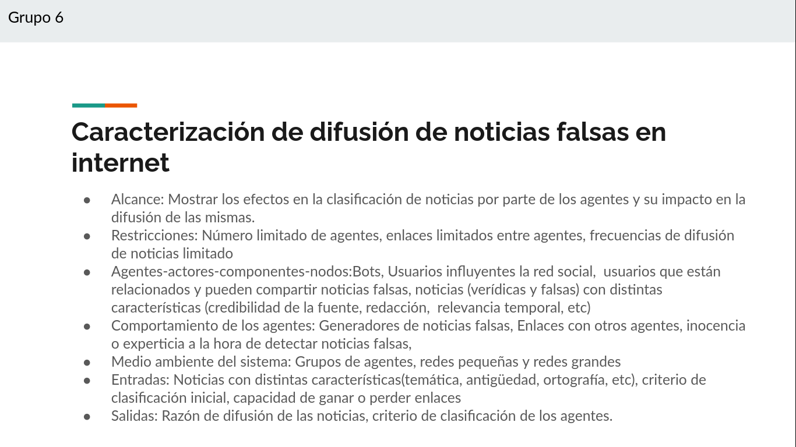

# Actividad 4

- **Grupo:** 6
- **Fecha de asignación:** [2021-03-04](../../class_notes/2021_03_04.md)
- **Fecha de entrega:** 2021-03-09

## Descripción

- Nombre del sistema
- Definir el alcance, restricciones.
- Definir los agentes, actores, componentes, nodos.
- Comportamientos de los agentes, actores, componentes, nodos.
- Medioambiente donde sucede el fenómeno
- Entradas y salidas del sistema.

[presentación](https://docs.google.com/presentation/d/1GtAfk3kl4baPRSSNkiyOWEt3LF--X3h4Q3pgR2yR7aw/edit#slide=id.p)

## Solución

