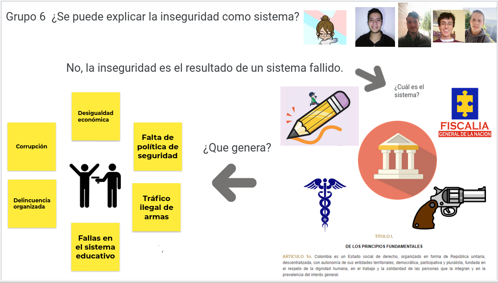

# Presentación del curso

## Objetivos de Aprendizaje

3. Proceso de definición de arquitectura
4. Reflexionar sobre el rol de arquitectos de software.

- El **pensamiento sistémico** es la capacidad de interpretar los fenómenos de un sistema.
- En un sistema es importante identificar:
  - Entradas
  - Salidas
  - Elementos, con sus interdependencias.

## Actividad

