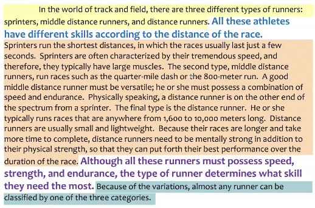

# Clase 2021-03-02

## Estructura de un parrafo o sección

- Es una estructura que facilita la escritura y lectura de textos.
- Topic: Idea principal
- Support: Iddeas secundarias que soportan la idea principal
- Return: Retorno a la idea principal reforzandolo.
- Bridge: Une la idea principal con las ideas de soporte
- Interpretation:

## Introducción

- Es importante porque
  - Sintetiza el objetivo del docuemnto
  - Contextualiza al lector frente a objetivos, procedimientos y resultados
  - Carta de presentación del docuemento
  - Estructura del documento
  - Tiene una estrucutra similar a la de un ensayo:
    - Idea principal
    - Desarrollo
    - Conclusiones
- Thesis Statement: Idea más importante, lo que se quiere decir, lo que se quiere aportar

  

  

- Se puede agregar un parrafo adicional por cada idea secundaria que refuerce la idea principal.
- La introducción se puede escribir como una guía al inicio, antes de desarrollar el paper, luego recibir modificaciones y mejoras
- Qué trabajos realizados soportan tus ideas y las motivan
- Contribución: thesis statement
- Conclusiones:
  - Cierra el ensayo
  - Refuerza la idea principal
  - **No** deben aparecer nuevas ideas.