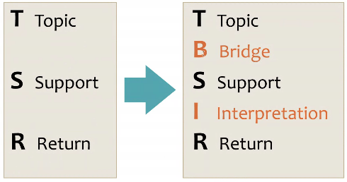
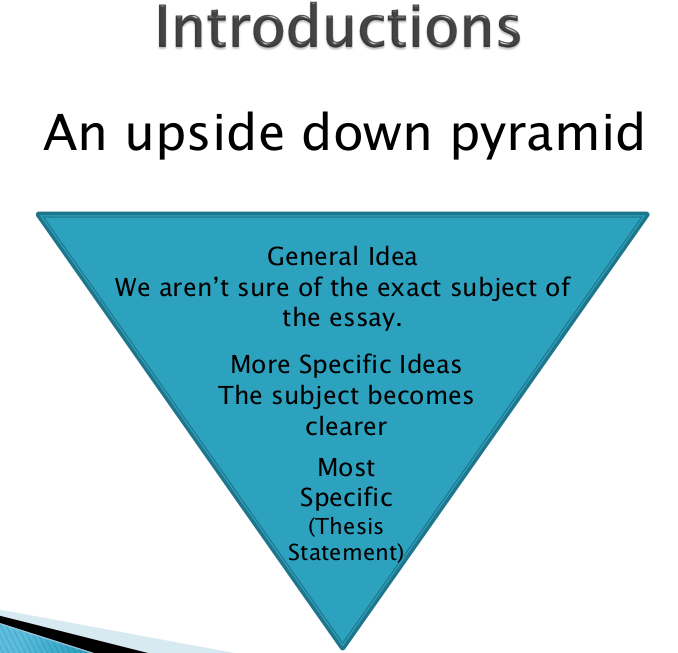

# Clase 2021-03-02

## Estructura de un parrafo o sección

- [Diapositivas](../presentations/000.pdf)

- Es una estructura que facilita la escritura y lectura de textos.
- **Topic:** Idea principal
- **Support:** Iddeas secundarias que soportan la idea principal
- **Return:** Retorno a la idea principal reforzandolo.
- **Bridge:** Une la idea principal con las ideas de soporte. Une información antigua con información nueva de los soportes.
- **Interpretation:** Especifica el *¿por qué?* se escribe sobre este tema. Esta parte muestra a su lector sus habilidades de pensamiento crítico. cuál es el significado de las oraciones escritas antes.

En el mundo del atletismo, hay tres tipos diferentes de corredores: velocistas, corredores de media distancia y corredores de fondo.

Todos estos deportistas tienen diferentes habilidades según la distancia de la carrera.

Los velocistas corren las distancias más cortas, en las que las carreras suelen durar solo unos segundos. Los velocistas a menudo se caracterizan por su tremenda velocidad y, por lo tanto, suelen tener músculos grandes. El segundo tipo, los corredores de media distancia, corren carreras como la carrera de un cuarto de milla o la carrera de 800 metros. Un buen corredor de media distancia debe ser polivalente; él o ella debe poseer una combinación de velocidad y resistencia. Físicamente hablando, un corredor de fondo está en el otro extremo del espectro de un velocista. El último tipo es el corredor de fondo. Por lo general, él o ella corre carreras que tienen entre 1.600 y 10.000 metros de largo. Los corredores de fondo suelen ser pequeños y ligeros. Debido a que sus carreras son más largas y requieren más tiempo para completarlas, los corredores de fondo deben ser fuertes mentalmente, además de su fuerza física, para que puedan presentar su mejor desempeño durante la carrera.

Aunque todos estos corredores deben poseer velocidad, fuerza y ​​resistencia, el tipo de corredor determina qué habilidad
ellos más lo necesitan.

Debido a las variaciones, casi cualquier corredor puede clasificarse en una de las tres categorías.

Con esta estructura, puedes demostrar que puedes analizar bien los textos y pensar críticamente sobre ellos.

## Introducción

- [Diapositivas](../presentations/001.pdf)

- Es importante porque
  - Sintetiza el objetivo del docuemnto
  - Contextualiza al lector frente a objetivos, procedimientos y resultados
  - Carta de presentación del docuemento
  - Estructura del documento
  - Tiene una estrucutra similar a la de un ensayo:
    - Idea principal
    - Desarrollo
    - Conclusiones
- Thesis Statement: Idea más importante, lo que se quiere decir, lo que se quiere aportar

  

  

Ningún hombre es una isla ”, escribió el poeta inglés John Donne. No estamos solos en este mundo y lo que hacemos tiene un efecto en los demás.

De hecho, lo que hagamos por los presos afectará tanto a nuestras vidas como a las de ellos.

Si queremos que los criminales se conviertan en miembros útiles de la sociedad cuando salgan de la cárcel, debemos educarlos mientras todavía están en prisión. 

- Se puede agregar un parrafo adicional por cada idea secundaria que refuerce la idea principal.
- La introducción se puede escribir como una guía al inicio, antes de desarrollar el paper, luego recibir modificaciones y mejoras
- Qué trabajos realizados soportan tus ideas y las motivan?
- **Contribución:** thesis statement
- **Conclusiones:**
  - Cierra el ensayo
  - Refuerza la idea principal
  - **No** deben aparecer nuevas ideas.