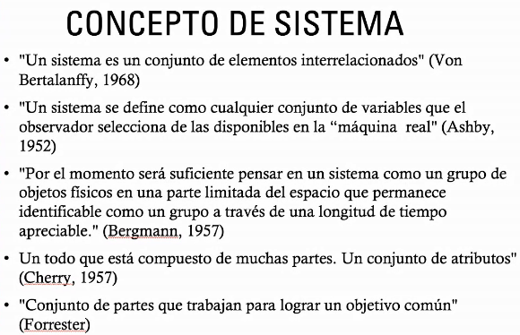

# Clase 2021-03-04

- [Presentación](../presentations/002.pdf)

- **Conocimiento:** Es un proceso y una capacidad.
- Pensamiento sistémico:
  - **Perspectiva epistemológica** para crear y usar el conocimiento, visto como un marco de trabajo. Es una **teoría** sobre la cual se interpreta la realidad.
  - Visión para entender los fenómenos desde la teoría de sitemas
  - framework para interpretar las cosas, hacer uso del conocimiento

    

    - **Supuesto:** Suposición o hipótesis para iniciar una investigación, un estudio o un análisis.
    - **Lema:** Supuesto comprobado muchas veces, es más válido, es mayor que el supuesto.
    - **Teorema:** Con el tiempo puede cambiar.
    - **Teoría:** Consensos de grupos académicos, tienen la posibilidad de cambiar, una forma de interpretar la realidad.
    - **Ley:** Es algo determinístico, comprobado, cabe la posibilidad de que la ley cambie (aunque muy poco probable).

  - **Origen:**

    

    

    

    - En ingeniería los sistemas son diseñados
    - Matemáticas: conjunto de sub-conjuntos = Sistema

    

    - El sistema tiene una dinámica
    - Un sistema es una serie de componentes diseñados para lograr
un objetivo particular según el plan.
  - **Principios:**

    

    - **Causalidad:** acción reacción, si la entrada es igual en el tiempo la salida es siempre la misma para esa entrada (en los sistemas simples)
    - **Teleología:** Todos los elementos del sistema siempre están apuntando a un fin común. postula que todo sistema debe perseguir un propósito o fin y tener un proceso para lograr ese objetivo.
    - **Recursividad:**
      - Teoría de la fractalidad, tienten un elemento de diferentes niveles que tienen las mismas características que un elemento de otro nivel
      - Se puede tomar una parte del sistema para entenderlo globalmente
    - **Flujo de información:** 
  - **Propiedades:**
    - Abierto / Cerrado:
      - Interactúa con el ambiente o entorno?
      - Depende desde el punto de vista, puede que si no es usado por un individuo no interactúa con nada
      - Interacción con los demás sistemas
      - La mayoría de sistemas son abiertos
    - **Estructura:**
      - En el pensamiento sistémico es la configuración de interrelaciones entre componentes del sistema.
      - identificar **interdependencia** -> entender estructura, cómo se relacionan
      - Es entender como funciona la interdependencia
      - Algunos piensan que es el **Organigrama:** Un organigrama es la representación gráfica de la estructura de una empresa o cualquier otra organización, que incluye las estructuras departamentales y, en algunos casos, las personas que las dirigen, hacen un esquema sobre las relaciones jerárquicas y competenciales de vigor.
    - **Emergencia:**

        

      - Comportamiento acumulado final de las desiciones de los sub-componentes de un sistema.
    - **Comunicación:** Intercambio de información (no son solo pulsos eléctricos, puede ser matria o energía)
    - **Sinergia:** complementariedad de elementos para generar algo mejor de lo que se obtendría de forma individual

      

    - **Homeostasis:** Buscan estabilidad, se autocompone, autorrepone.
      - Referido a organismos vivos o sistemas adaptables
      - opera frente a variaciones del ambiente.

      

    - **Equifinalidad:**

        

      El sistema llega a un punto siempre, así tome diferentes caminos.

    - **Entropía:**

      

      - Grado de desorden de un sistema
      - Alta entropía - mucha información, Sistema inestable
      - Baja entropia: Sistema estable, información no variable
    - **Realimentación:** Salida que retorna a la entrada para verificar que el sistema cumple su objetivo

      

      - **Positiva:** LLeva a la inestabilidad de los sistemas
      - **Negativa:** Se compara, hay una diferencia entre elementos
      - La realimentación positiva​ es uno de los mecanismos de realimentación por el cual los efectos o salidas de un sistema causan efectos acumulativos a la entrada, en contraste con la realimentación negativa donde la salida causa efectos sustractivos a la entrada.​
    - **Jerarquización:**
      - Hay un interventor, estrategias de control frente a sus salidas
      - Son capaces de controlarce a si mismos sin afectar al sistema superior
      - Si el ssitema superio se ve afectado, los inferiores se ven afectados y deben ayudarlo a regularse.
      - El comportamiento y propiedades de un sistema interno contribuye al comportamiento del sistema mayor.
    - **Control:** usando difernetes estrategias
      - Los sistemas deben ser regulados en busca de propositos
        - Sistemas físicos (ej. máquinas) -> realizables
        - Sistemas vivientes -> objetivos y autorregulación
    - **Ley de variedad requerida:**

      

      - hay que aceptar que si un sistema quiere evolucionar, debe aumentar su complejidad.
      - incrementa en un mismo tipo de complejidad.

## Actividad

- Caracterizar el sistema del proyecto

