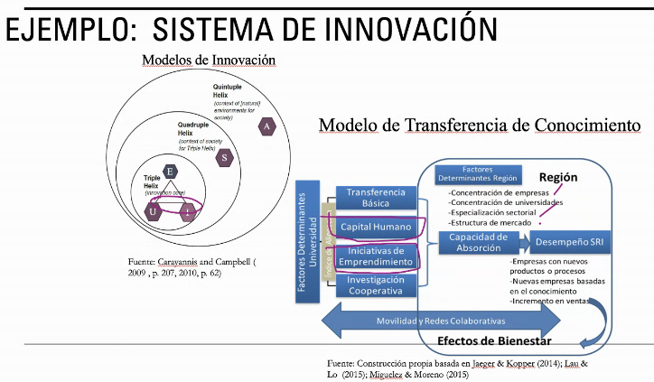
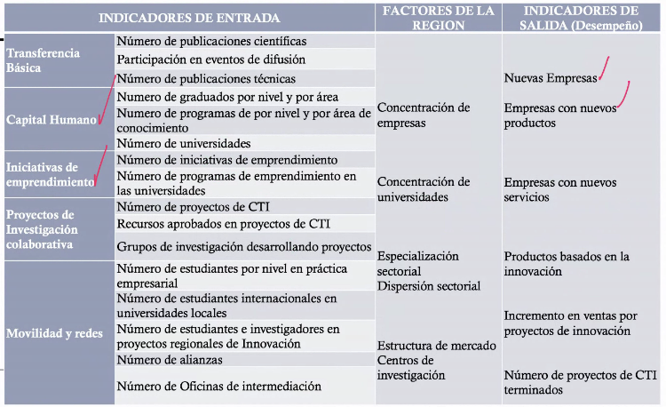

# Clase 2021-03-09

## Recuento clase previa

**Clase:** [2021-03-04](2021_03_04.md)

- Pensamiento Sistémico:
  - manera de interpretar un fenómeno, haciendo uso de los elementos de la teoría de sistemas.
- Ontología:
  - Posición del observador (puede hacer parte del sistema o estar por fuera)
- Axiología:
  - Qué se va a hacer con el conocimiento
  - Crear cosas nuevas
- Origenes
  - Desde la antigua grecia ya existía el pensamiento sistémico
  - Estructura social, música...
- Sistema:
  - Interacción de elementos, nodos, actores que producen un resultado
- **Causalidad:**
  - Todo tiene un efecto
  - En los sistemas básicos, se espera que para una misma entrada, se tenga la misma salida
- **Teleología:** Los elementos de un sistema se organiza con un objetivo común
- **Recursividad:** Hay sistemas en el interior de un sistema
- **Lo más importante del PS:** identificar la estructura del sistema, para comprenderlo y modelarlo
- **Emergencia:** comportamiento colectivo
- **Comunicación:** Entre los elementos de un sistema hay intercambio de información que puede ir en pulsos, materia o energia
- **Sinergia:** el todo el más importante que las partes
- **Homeostasis:** Tendencia del sistema a estabilizarce
- **Equifinalidad:** muchos caminos para ir a un objetivo
- **Entropía**
  - Mayor: Inestabilidad, mucha información
  - Menor: Sistema estable
- **Retroalimentación:** Se usan para mejorar  mantener un rango estable
  - **Negativa:** mantener en un rango de valores el sistema, estabilidad
  - **Positiva:** Disturbios para obligarlo a salir de us estado de estabilidad
- **Inmergencia Jerarquización:** Cada sistema interno no afecta al sistema superior pero sí al interior.
- **Control:** Mantener al sistema en un rango de parámetros para que funcione
- **Ley de variedad requerida:** complejidad del sistema acorde a la complejidad de sus variables.
- **Innovación:** nuevas formas de resolver un problema.
- **Tecnología:** formas de hacer, desarrollo de nuevas formas de hacer las cosas.

## Ejemplo - Caracterización de un sistema

- relación, estado-industria-empresa, para generar desarrollo en una sociedad.
- Se busca modelar la relación Universidad-Industria
- Al identificar la estructura, se entiende la **dinámica** del sistema

- **Nombre del sistema:** Sistema de Innovación
- **Alcance:** Transferencia de conocimiento de un sistema de innovación
- **Restricciones:**
- **Definir los agentes, actores, componentes, nodos:**
  - Organizaciones del gobierno
  - Universidades y centros de investigación
  - Organizaciones de intermediación
  - Organizaciones públicas y privadas
  - Sociedad
- **Comportamientos de los agentes, actores, componentes, nodos:**
- **Medioambiente donde sucede el fenómeno:**
  - Geográfico: Colombia
  - Red
- Entradas: necesidades
- Salidas: Proyectos, estudiante

