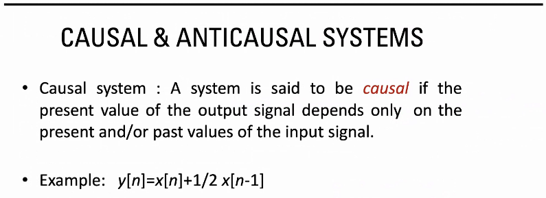
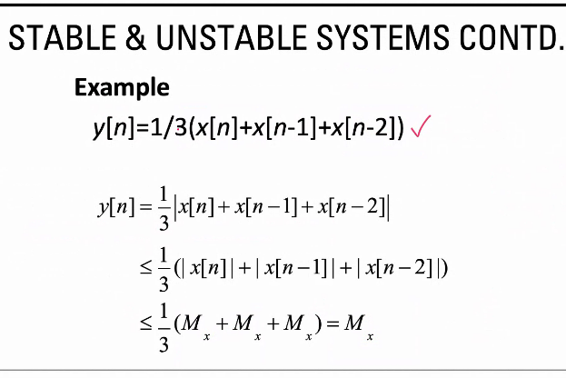

# Clasificación de Sistemas

## Según Boulding

- Isomorfismo: patrones

1. Buscar patrones entre los sistemas
2. Particularidad, interpretar patrón empírico

### Estáticas

Unidad, elemento fundamental del sistema. Con base en estos se puede formar el sistema.

### Sencillos y predecibles

A una misma entrada, una salida. Usualmente sistemas cerrados.

### De control o cibernéticos

Tiene retroalimentación (positiva y/o negativa) para autoregularse o provocar cierta inestabilidad.

### Abiertos que conservan estructura

Hay elementos que pueden tomar desiciones propias.
- Decisiones colectivas
- Emergencia
- Autorreproducción
- Auto-organización: se intenta mantener la estructura
- Homeostasis

### Genético-Sociales

Intenta construir un objetivo común

### Reino animal

hay información estructurada. Información a nivel de alerta (instintos), tienen un objetivo común

### Humano

Aparece el lenguaje, la autoconciencia, valores que son potenciados en el otro nivel

### Sociedad

Comparten cultura, objetivos, valores.

#### Trascendentales

Sistema de sistemas

## De acuerdo a la Dinámica

La dinámica tiene las siguientes variables:

- Tiempo
- Espacio

Se expresa en ecuaciones diferenciales donde interactúan estas variables

Función de transferencia $Y^{(r)} = T^{(r)} (X^{(r)})$

$T^{(r)}$ - Matriz

### Causal y Anticausal

De una entrada, una salida. El sistema depende de salidas previas.
Anticausal -> **No** depende del pasado -> ver potencial de predicción de un modelo

### Lineal y no lineal

- Lineal: Superposició, expresión polinomial
- No lineal:

### Variante e invariante en el tiempo

- Invariante: La entrada en 2 tiempos distintos es la misma salida
- Variante: la entrada en 2 tiempos distintos es **diferente**.

- Lo ciclico es invariante.

### Estables e inestables

- Todo conjunto de entradas, tienen un conjunto de salidas (siempre las mismas, así una entrada tenga un conjunto de salidas en el rango). Siempre que estén limitados en el dominio y rango definidos
- Acotado en entradas y salidas, no se puede salir del rango ni del dominio

### Estático y Dinámico

- Estáicos: No depende de su historia, no tiene memoria
- Dinámicos: Hace que el comportamiento actual dependa de su historial

El capacitor controla los flujos de voltaje, por lo que es dinámico.

## Inversos e Invertibles

- Invertible: tiene una inversa.
  - Dada una entrada X una salida Y
  - Con el sistema invertido, ingresando Y se obtiene X
- Usados para reconstruir fenómenos pasados

## Ejercicios

1. Definir si es estable o inestable

  

2. d
  - Poner un ejemplo