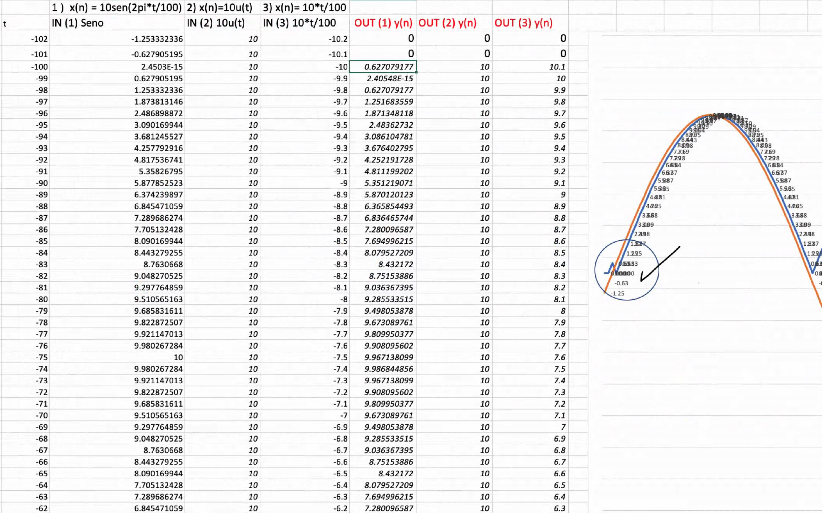
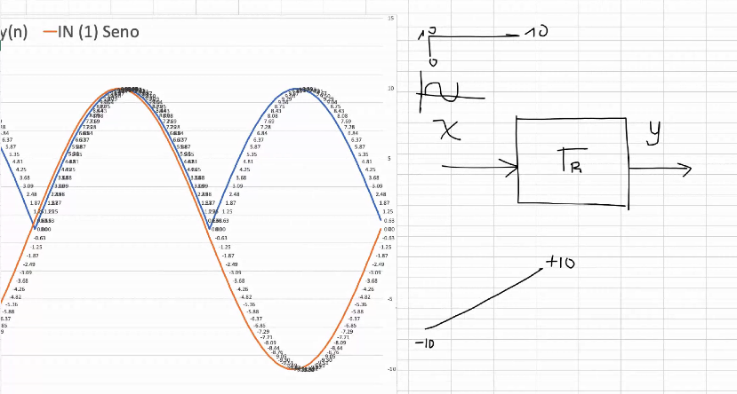
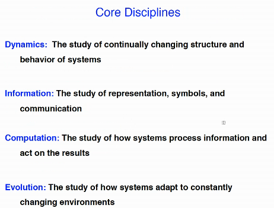

# Clase 2021-03-16

Técnicas de identificación de sistema
- se ingresa un dato conocido
  - Cero
  - escalón
  - seno

  

  

  - Variante: hay al menos un step desplazado
  - Sistema estable

- sistema que abarca otros sistemas
- Sistemitas que tienen características

- Sistemas tienen particularidades, se quieren buscar isomorfismos, propiedades similares. Generalización, busca isomorfismos
- Arreglo de sistemas. Macrosistemas, sistemas a diferentes niveles (bolding :v 9 niveles), de forma jerárquica

## Sistemas complejos

### Características
- La **interdependencia** es muy importante en el comportamiento final
- Tiene **Evolución** basado en interacción e interdependencia.
- Las diferencias entre un sistema complejo y uno normal
  - Evolución, basado en la información de sus sub-sistemas y sus elementos. Implica un cambio en la estructura
  - Aprendizaje:
- Existen multi-capas

### Ejemplos
- Sistema de hormigas
  - Nivel 4
  - Las ormigas crean estructuras y crear estructuras más importantes
  - no existe un control central, sucesos de forma emergente
- Neuronas
  - Regeneración
  - las nuevas neuronas suplen la lavor de las que han muerto
  - categorización
  - se reunen para construir algo
- Sistema inmune
  - Capaz de detectar problemas
  - Resuelven problemas focalizados
  - No hay control central

### Propiedades

- es un paradigma para interpretar los sistemas
- Conformados por sismples agentes, nodos
- no hay interacción lineal entre componenetes
- No existe control central. toman desiciones conciderando el ambientes y comportamientos de vecinos
  - El 'control central' toma desiciones con base en el ambiente y desiciones de vecinos
- Comportamientos emergentes
  - organización jerárquica
  - procesamiento de información
  - es dinámico
  - Evolución y aprendizaje.
- Puede devolverse pasos, cambiar, evolucionar

- estudio pretende
  - Entender los sistemas complejos
  - Generar teorías para explicarlos
- Metodologías
  - Experimentación
    - los exprerimentos son repetibles, apra confirmar o corregir resultados
    - Analítica, nos permite diagnosticar comportamientos con probabilidad, basados en historial de datos
  - Simulación
    - Es más econ+omica y rápida

- complejidad desorganizada: comportamiento final impredescible
  - El mundo es complejo, no es medible
- Complejidad organizada: varibales contables, se limita el espacio
  - Se buscan patrones
  - Se buscan entradas y salidas
  - Se busca detectar comportamientos
- El fin del estudio es controlar el sistema, para llevar al sistema al comportameinto final deseado