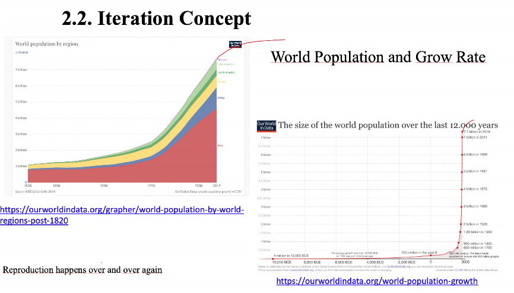
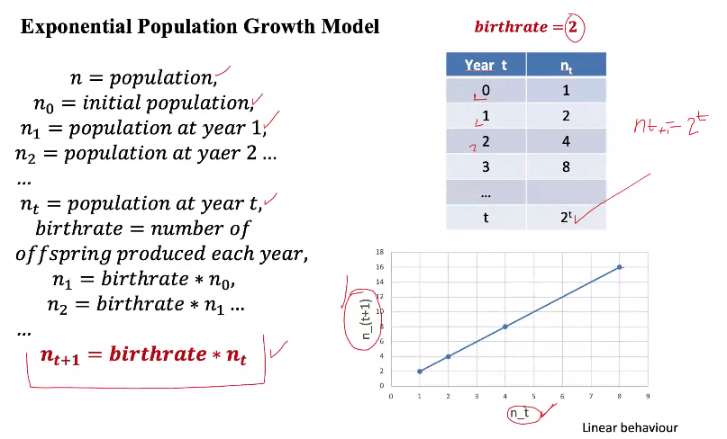
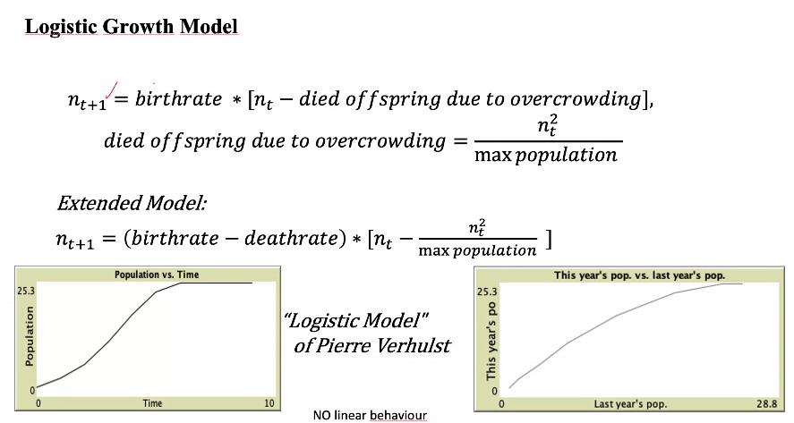
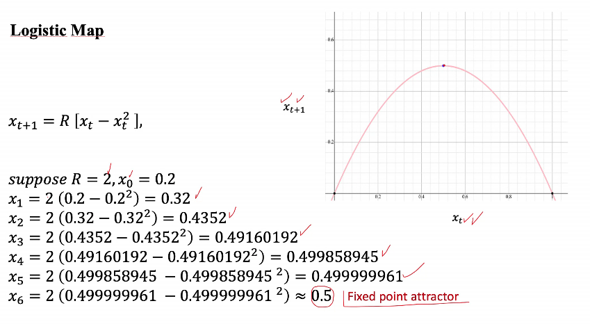

## Clase 2021-03-23

- [Diapositivas](../presentations/006.pdf)

- Clase pasada: [2021-03-18](2021_03_18.md)

- **Modelo:** Es una abstracción de la realidad
- **Tendencias:** Son frecuentes regularmente. Si se repiten continuamente se generan patrones, luego pueden escalar a estructuras.
- **Sistema:**
  - Conjunto de $p$ elementos
  - Cada elemento tiene inter-relaciones e interdependencias
  - En un sistema se puede definir un sistema de ecuaciones diferenciales
- Los sistemas caóticos son sensibles a las condiciones iniciales
- La condición inicial siempre va a estar sesgada, por lo que los sistemas son impredescibles
- ya no hay aleatoriedad, hay insertidumbre
- **Iteración:** Proceso cíclico

  

    - gran parte de los sistemas tienen componentes cíclicos

  

- **Límite central**
  - La sumatoria de las probabilidades, tienen un comportamiento de distribución central
  - La suma de las distribuciones tienen una distribución normal
- Modelo de crecimiento con restricciones

  

- **Atractor:** límite que se mantiene sin importar qué tanto se modifiquen los parámetros

  

- **Mapa logístico:** una ecuación simple y completamente determinista. deterministico, pero al cambiar los parámetros se pede llevar a la incertidumbre