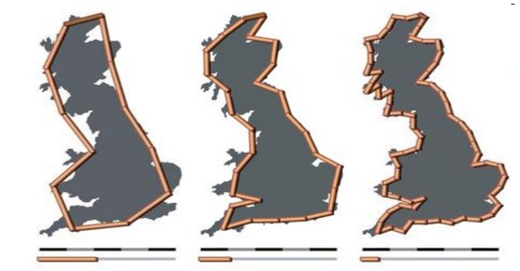
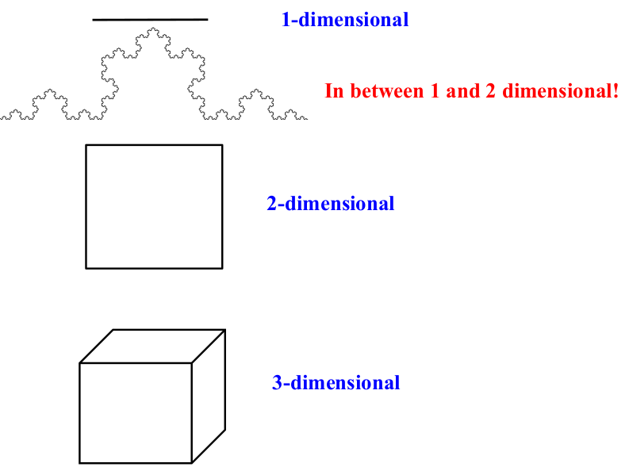
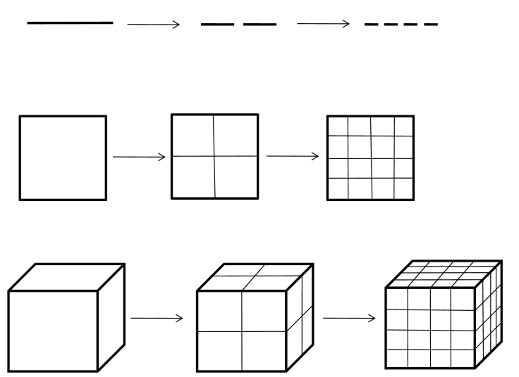
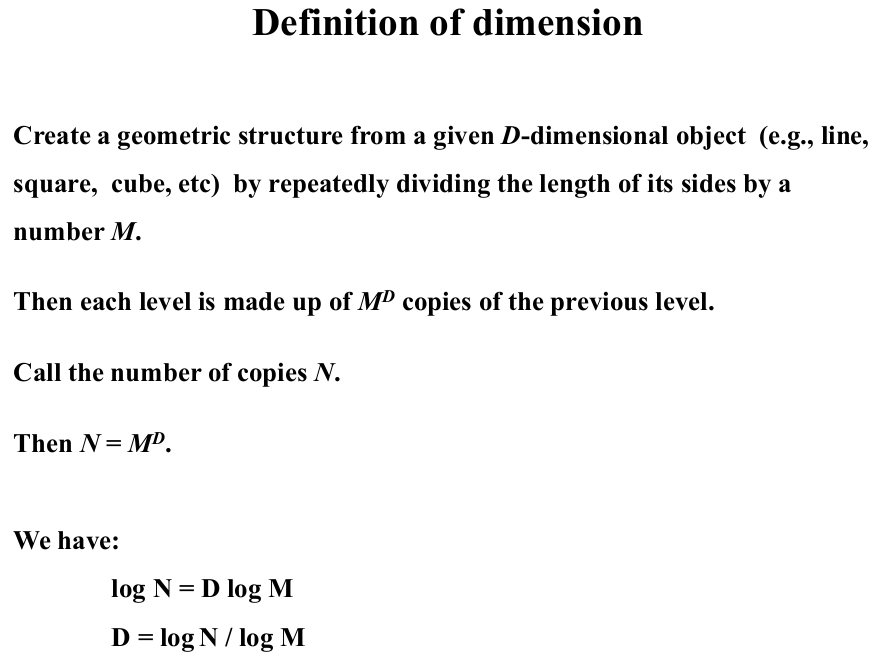
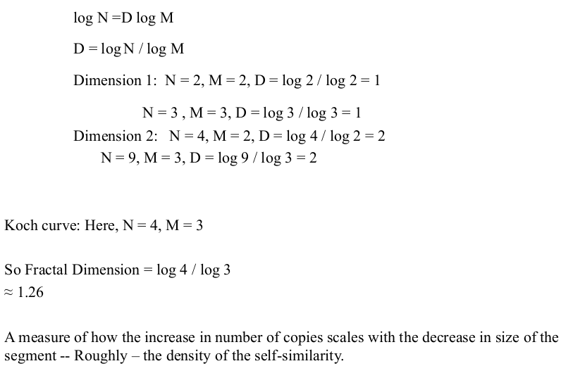
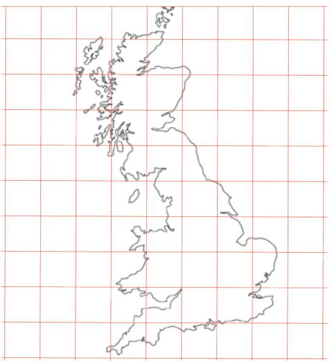
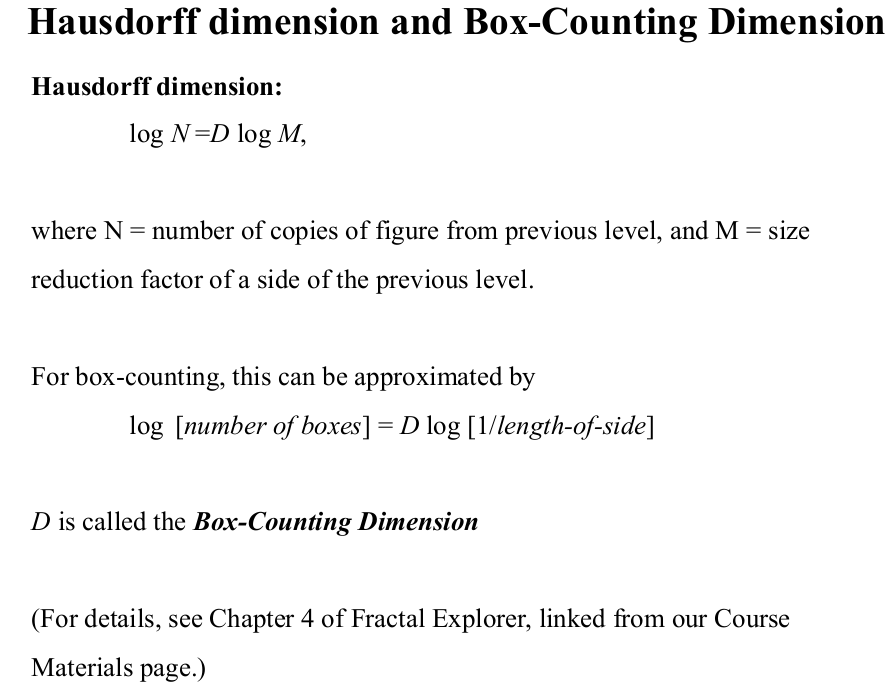
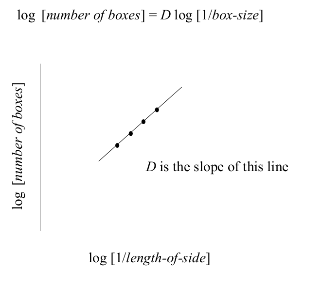

# Clase 2021-03-25

- [Diapositivas](../presentations/007.pdf)
- ¿Para qué sirve la fractalidad?
  - Es parte de la medida de la complejidad
  - En las funciones recursivas se hace uso del concepto de fractalidad
- Hay fractalidad en la naturaleza

- **Información Shannon:** Otro aspecto importante dentro de esta teoría es la resistencia a la distorsión que provoca el ruido, la facilidad de codificación y descodificación, así como la velocidad de transmisión. Es por esto que se dice que el mensaje tiene muchos sentidos, y el destinatario extrae el sentido que debe atribuirle al mensaje, siempre y cuando haya un mismo código en común. Si la selección del mensaje se plantea únicamente entre dos alternativas diferentes, la teoría de Shannon postula arbitrariamente que el valor de la información es uno. Esta unidad de información recibe el nombre de bit. Para que el valor de la información sea un bit, todas las alternativas deben ser igual de probables y estar disponibles.
- **Complejidad del algoritmo:**
  - Notación Big O
  - Cuándo es computable
  - un algoritmo puede ser sencillo y complejo. Ej. pocas lineas de código, alta complejidad, recursividad.
- **Mínima longitud para la descripción:**
  - Unidad mínima en la que se describe o entiende un algoritmo
- **Dimensión Fractal:**
- **Profundidad Lógica:** Hace referencia al esfuerzo que se tiene que hacer para poder entender algoritmos o construirlos.
- **Profundidad termodinámica:** Los conceptos de entropía vienen de la termodinámica
- **Complejidad afectiva:** relacionado con fractalidad
- **Grado de jerarquía:** Qué tantos niveles puede tener un sistema. Si tiene muchos niveles puede ser complicado, mas no complejo

## Fractalidad

- La estructura, patrones tienden a repetirse.
- En las matemáticas existen fractales perfectos, en la naturaleza alcanzable a la vista no, hay aproximaciones.
- **Benoit Mandelbrot:** Propone para medir similaridad contenida -> Dimensión fraccional. Partes similares a las demás.
  - Fractalidad: fracturas similares
  - Teoría de la rogusidad: Describe el mundo real, entre más rugoso, más fractal, más repeticiones.
- Se pueden hacer mediciones
- **Triangulación:** Se miden zonas geográficas con reglas de diferentes tamaños

  

- Se pueden definir las dimensiones de los fractales

  

  Dividiendo las reglas en partes iguales por cada iteración

  

  Cada nivel se compone de copias de tamaño $M^D$ $1/M^D - tamaño$ del nivel anterior

  M es la cantidad de divisiones

- Definición de dimensión

  

  Cree una estructura geométrica a partir de un objeto D-dimensional dado (por ejemplo, línea, cuadrado, cubo, etc.) dividiendo repetidamente la longitud de sus lados por un número M.

  Luego, cada nivel se compone de copias M D del nivel anterior. Llame al número de copias N.

  

  

  Pueden existir dimensiones no enteras

  

  - M cantidad de sparticiones
  - N es la cantidad de segmentos que salen de cada una de las particiones

  

  - log(4)/log(2) -> 2 ya que se divide cada lado en 2
  - log(3)/log(2) ?

- Las dimensiones fractales sirven para comparar que tan complejo es un elemento
- **Caminatas aleatorias:** Ejemplo ormigas
  - Cuando hay estados, se pasan de uno a otro
  - cuando hay muchos estados, no se saben a cuál va a pasar
  - Hay patrones en ellas
- Medir elemento:
  - Se crea una matriz de difernetes tamaños
  - Se mira en cuántos cuadors está contenido el elemento
  - Con mayores cuadros, mayor detalle

  

  

  La dimensionalidad tiene una tendencia lineal

  