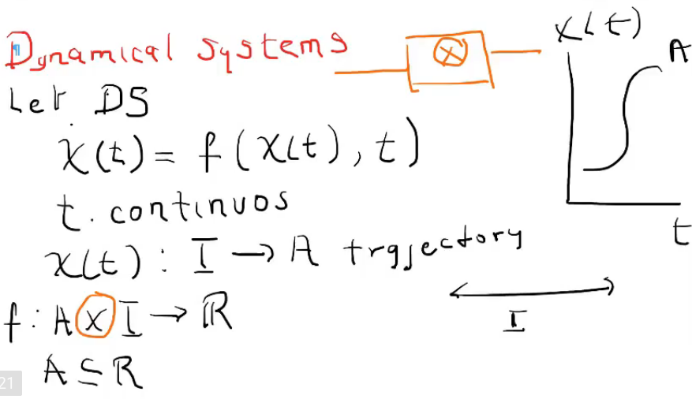
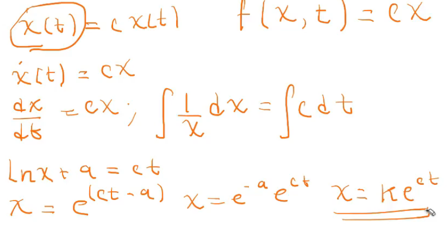
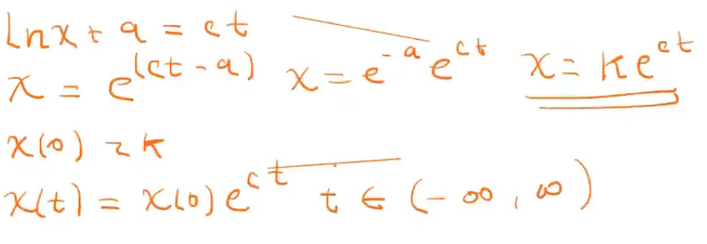
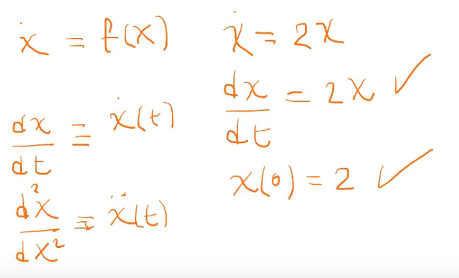

# Dinámica de sistemas

- Variables de la dinámica de sistemas:
  - Espacio
  - Tiempo
- Un sistema dinámico continuo, es una ecuación diferencial donde la **variable principal** es el tiempo.

  

  - La función $X(t)$ es una función que va de un intervalo a un conjunto A en los reales
  - Trayectoria: La transición de ir de un conjunto a otro, transición de I a A.
  - $AXI -> R$ -> La X representa una **convolución**.
  - Convolución: puede ser una multiplicación, combinación lineal...
  - La solución es encontrar todas las posibles trayectorias $X(t)$.

  

  

  - Solución genérica de esa ecuación diferencial

## Recorderiz

- Toda ecuación diferencial básica debe tener una condición inicial para resolverla.

  