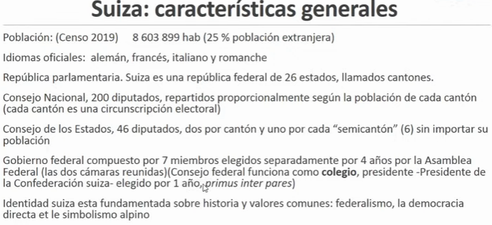
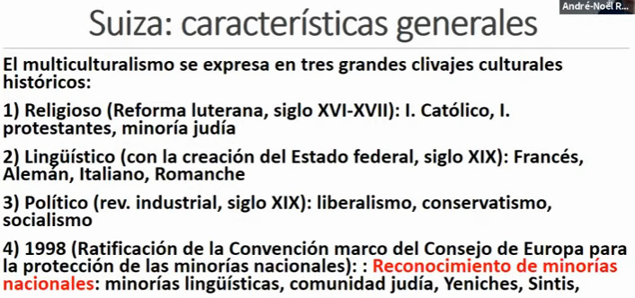
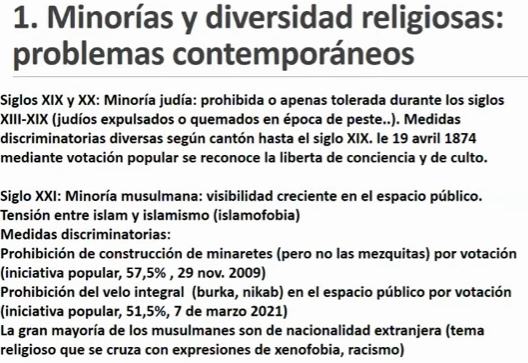
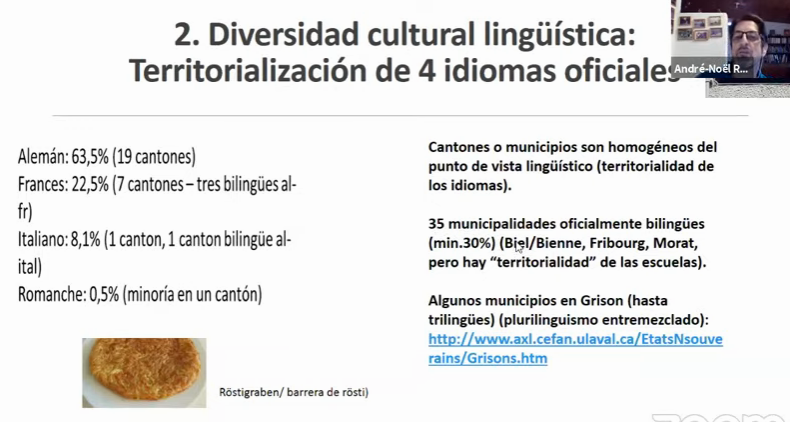
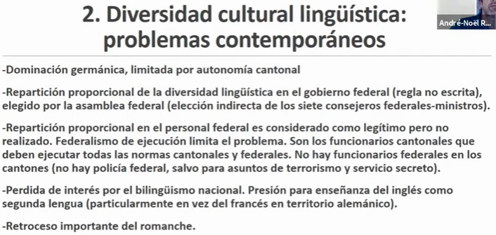
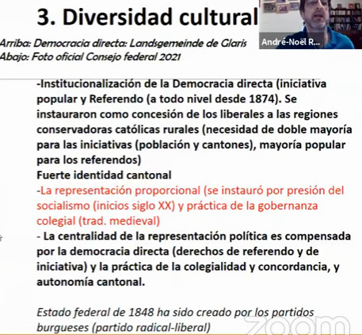
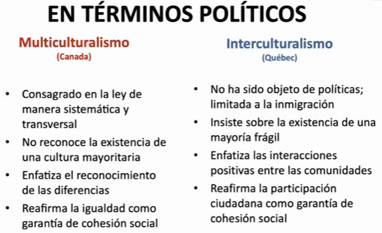

# El multiculturalismo en el mundo. Bob White, Carolina Sánchez, André Noel Roth

- 26 de febrero 1971, masacre en cali de estudiantes, 30 muertes
- 10 junio 1971, méxico, estudiantes 120 muertos
- 7 febrero 1971, se aprueba en Suiza el voto femenino
- primer estatuto multicultural en el mundo, en Suiza, en octubre del 71

## Carolina Sánchez

- país con más personas pertencientes a pueblos originarios
- diversidad linguistica
- En enero del 92, se reconoce la nación como pluricultural sustentada en pueblos originarios
- Se reconoce a las comunidades afromexicanas como parte de la composición pruliculturalidad
- Los pueblos indígenas y afromexicanos son las comunidades que tienen más índices de pobreza y sufren de discriminación
- Reto interculturalizar la sociedad

## André Noel Roth - Suiza

- 4 idiomas oficiales, 25%  población extranjera
- Suiza es una confederación de 26 estados, unidos por constitución federal
- Clivajes religiosos, lingüísticos y políticos
- En 1998 se da el reconocimiento de minorías judías, Yeniches, Sintis
- A afrontado 5 guerras con gran matiz religioso.
- En suiza existe una grán diversidad lingüística, existen cantones bilingües y trlingües
- Se hacen elecciones cantonales
- las minorías étnicas nómadas son reconocidas, pero no representadas políticamente

## Bob White

- 38 millones de habitantes
- En Quebec hay una población que apoya el intraculturalismo, hay roces de ideales entre la población canadiense
- En la historia no se tienen en cuenta las comunidades indígenas hasta la llegada de los europeos
- Las comunidades indígenas son invisibilizadas.

## Preguntas

- ¿Cómo identificar el avance en la educación frente al reconocimiento pluricultural?
- En Suiza, ¿actualmente hay proyectos transversales en los cantones que busquen reducir la xenofobia hacia las minorías presentes en el país?

## Síntesis

- 1971/02/26 ocurre en Colombia, Cali una masacre de estudiantes dejando 30 muertes
- 1971/02/07 se aprueba en Suiza el voto femenino.
- México es uno de los paises con más personas pertenecientes a pueblos originarios
- En enero de 1992, se reconoce a México como nación pluricultural sustentada en pueblos originarios.
- En méxico los pueblos indígenas y afromexicanos son las comunidades que tienen más índices de pobreza y sufren de discriminación
- El reto en México consiste en interculturalizar la sociedad.
- Suiza es una confederación de 26 cantones, unidos por constitución federal, cada uno tiene su propia cultura.
- En Suiza las minorías étnicas nómadas son reconocidas, pero no representadas políticamente
- En Quebec hay una población que apoya el intraculturalismo, hay roses de ideales entre la población canadiense.
- La historia Canadiense tiene en cuenta las comunidades indígenas hasta la llegada de los europeos.